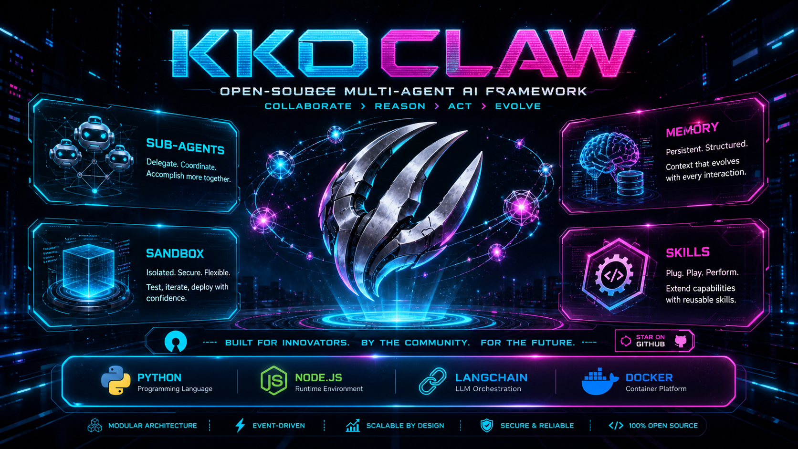

> ## 🚀 Important: The QiongQi-engine-based OClaw has moved
>
> This repository (OClaw) continues to maintain the Python + LangGraph version.
> **For the QiongQi-engine-based new OClaw, please visit 👉 [https://github.com/kkutysllb/KWorks](https://github.com/kkutysllb/KWorks) — the product has been renamed to KWorks and covers daily tasks, coding, and finance in different modes. It is currently in internal debugging and will be released in full once that wraps up…**
>
> **For the QiongQi-engine-based open-source repo, please visit 👉 [https://github.com/kkutysllb/QiongQi](https://github.com/kkutysllb/QiongQi) — it contains the related technical architecture, package structure documentation, and source code**
>
> The new repo uses a Node.js native runtime, removing the Python/LangGraph process boundary with thread-as-source-of-truth + direct streaming events.

---

<p align="center">
  <picture>
    <source media="(prefers-color-scheme: dark)" srcset="assets/cover.png">
    
  </picture>
</p>

---

[](./backend/pyproject.toml)
[](./Makefile)
[](./LICENSE)

**English** | [简体中文](./README.md)

OClaw is an open-source **super agent harness**. It organizes **sub-agents**, **memory**, and **sandbox** together, combined with extensible **skills**, enabling agents to accomplish almost anything.

---

## Table of Contents

- [Quick Start](#quick-start)
  - [Configuration](#configuration)
  - [Running the App](#running-the-app)
    - [Deployment Recommendations & Resource Planning](#deployment-recommendations--resource-planning)
    - [Starting Services](#starting-services)
    - [Service Management Commands](#service-management-commands)
    - [Service Ports](#service-ports)
  - [Advanced Configuration](#advanced-configuration)
    - [Sandbox Mode](#sandbox-mode)
    - [MCP Server](#mcp-server)
    - [IM Channels](#im-channels)
    - [LangSmith Tracing](#langsmith-tracing)
- [Desktop Client](#desktop-client)
  - [Desktop Development Setup](#desktop-development-setup)
  - [Desktop Run Commands](#desktop-run-commands)
  - [Desktop Features](#desktop-features)
  - [Desktop Auto-Update](#desktop-auto-update)
- [Core Features](#core-features)
  - [Coding Agent & Qiongqi Engine](#coding-agent--qiongqi-engine)
  - [Skills & Tools](#skills--tools)
  - [Sub-Agents](#sub-agents)
  - [Sandbox & File System](#sandbox--file-system)
  - [Context Engineering](#context-engineering)
  - [Long-Term Memory](#long-term-memory)
  - [Token Usage Statistics](#token-usage-statistics)
- [Project TODO](#project-todo)
  - [Completed Today](#completed-today)
  - [Pending Work](#pending-work)
- [Recommended Models](#recommended-models)
- [Embedded Python Client](#embedded-python-client)
- [Documentation](#documentation)
- [Safe Usage](#-safe-usage)
- [Contributing](#contributing)
- [License](#license)

## Quick Start

### Configuration

1. **Clone the repository**

   ```bash
   git clone https://github.com/kkutysllb/kk_OClaw
   cd kk_OClaw
   ```

2. **Generate local configuration files**

   Run from the project root:

   ```bash
   make config
   ```

   This command generates local configuration files based on the example templates.

3. **Configure the models you want to use**

   Edit `config.yaml` and define at least one model:

   ```yaml
   models:
     - name: gpt-4                       # internal identifier
       display_name: GPT-4               # display name
       use: langchain_openai:ChatOpenAI  # LangChain class path
       model: gpt-4                      # model identifier used by the API
       api_key: $OPENAI_API_KEY          # API key (environment variables recommended)
       max_tokens: 4096                  # max tokens per request
       temperature: 0.7                  # sampling temperature
   ```

4. **Set API keys for the configured models**

   Recommended to set them in the `.env` file in the project root:

   ```bash
   TAVILY_API_KEY=your-tavily-api-key
   OPENAI_API_KEY=your-openai-api-key
   ```

#### Model Provider Configuration

OClaw declares available models through the `models` array in `config.yaml`. Each model is instantiated by a LangChain `BaseChatModel` subclass (the `use` field points to the class path). The table below lists the common adaptation strategies.

##### 1. Generic adaptation (standard OpenAI-compatible)

Works for any provider that exposes an OpenAI-compatible `/v1/chat/completions` endpoint (proxy gateways, self-hosted vLLM, Kimi, OpenRouter, etc.). Use `langchain_openai:ChatOpenAI` directly:

```yaml
models:
  - name: kimi-k2.5
    display_name: Kimi K2.5
    use: langchain_openai:ChatOpenAI
    model: kimi-k2-0905-preview
    api_key: $KIMI_API_KEY
    base_url: https://api.moonshot.cn/v1
    max_tokens: 8192
    temperature: 0.7
```

| Field | Description |
|------|-------------|
| `use` | LangChain class path; for generic cases always `langchain_openai:ChatOpenAI` |
| `model` | Model identifier from the provider's docs (case-sensitive) |
| `api_key` | Prefer `$ENV_VAR` placeholder read from `.env` or process env to avoid hard-coding |
| `base_url` | Root URL of the OpenAI-compatible endpoint, must end with `/v1` (or as specified by provider) |
| `max_tokens` | Max tokens per response; affects cost |
| `temperature` | 0–1, higher = more divergent |
| `supports_thinking` | Whether reasoning mode is supported (controls visibility of the reasoning-depth switcher in the UI) |
| `supports_vision` | Whether image input is supported (controls availability of the `view_image` tool) |
| `supports_reasoning_effort` | Whether the `reasoning_effort` parameter is supported. Set to `false` if not (e.g. GLM-5) |
    | `when_thinking_enabled` / `when_thinking_disabled` | Additional parameters merged into the request when reasoning mode is toggled; typically `extra_body.thinking.type` |

##### 2. Dedicated adapters for Chinese providers (patched classes required)

Major Chinese model providers claim OpenAI compatibility but diverge from LangChain's default serialization in several ways. OClaw ships dedicated patch classes for these providers — **you MUST point the `use` field at the patch class path**, otherwise you will hit various HTTP 400 errors, lost `reasoning_content`, multiple-`system`-message rejections, and so on.

| Provider | Patch class | Problems solved |
|----------|-------------|-----------------|
| **DeepSeek** | `kkoclaw.models.patched_deepseek:PatchedChatDeepSeek` | Missing `reasoning_content` in multi-turn conversations under thinking mode → HTTP 400 `The reasoning_content in the thinking mode must be passed back to the API.` Also handles model-name aliases (`deepseek_v4` → `deepseek-v4-flash`), strips unsupported `image_url`, and remaps `base_url` → `api_base` |
| **Zhipu GLM** | `kkoclaw.models.patched_zhipu:PatchedChatZhipu` | The `stream_options` parameter injected by LangChain by default is rejected by GLM → error code 1210 `API 调用参数有误`. Also strips non-`text` content blocks (GLM only accepts `messages.content.type = 'text'`) |
| **MiniMax** | `kkoclaw.models.patched_minimax:PatchedChatMiniMax` | 1. `reasoning_content` is lost in multi-turn conversations → `extra_body.reasoning_split=true` is required to return it; 2. MiniMax accepts only one `role: system` message, but skill loading injects several → error code 2013 `invalid chat setting`; 3. Inconsistent `name` across same-role messages is rejected — the patch cleans synthetic message `name` fields automatically |
| **Gemini (via OpenAI gateway)** | `kkoclaw.models.patched_openai:PatchedChatOpenAI` | When calling Gemini thinking models via an OpenAI-compatible gateway, `thought_signature` is dropped by the default serializer → HTTP 400 `INVALID_ARGUMENT: missing a 'thought_signature'`. The patch restores it from `additional_kwargs.tool_calls` |

**Typical configuration examples**:

```yaml
models:
  # DeepSeek (patch required for thinking mode, otherwise multi-turn errors)
  - name: deepseek-v3
    display_name: DeepSeek V3 (Thinking)
    use: kkoclaw.models.patched_deepseek:PatchedChatDeepSeek
    model: deepseek-reasoner
    api_key: $DEEPSEEK_API_KEY
    timeout: 600.0
    max_tokens: 8192
    supports_thinking: true
    supports_vision: false
    when_thinking_enabled:
      extra_body:
        thinking:
          type: enabled
    when_thinking_disabled:
      extra_body:
        thinking:
          type: disabled

  # Zhipu GLM-5 (coding endpoint, patch required)
  - name: glm-5-turbo
    display_name: GLM-5-Turbo
    use: kkoclaw.models.patched_zhipu:PatchedChatZhipu
    model: GLM-5-Turbo
    api_key: $ZHIPU_API_KEY
    base_url: https://open.bigmodel.cn/api/coding/paas/v4   # Coding endpoint
    # base_url: https://open.bigmodel.cn/api/paas/v4       # Generic endpoint
    max_tokens: 65536
    supports_thinking: true
    supports_reasoning_effort: false    # GLM-5 does not support reasoning_effort
    when_thinking_enabled:
      extra_body:
        thinking:
          type: enabled
    when_thinking_disabled:
      extra_body:
        thinking:
          type: disabled

  # MiniMax (international, patch required under thinking mode)
  - name: minimax-m2.5
    display_name: MiniMax M2.5
    use: kkoclaw.models.patched_minimax:PatchedChatMiniMax
    model: MiniMax-M2.5
    api_key: $MINIMAX_API_KEY
    base_url: https://api.minimax.io/v1
    max_tokens: 4096
    supports_thinking: true
    when_thinking_enabled:
      extra_body:
        thinking:
          type: enabled          # or "adaptive" (latest MiniMax API format)
    when_thinking_disabled:
      extra_body:
        thinking:
          type: disabled
```

##### 3. When to use a patch vs. the generic class?

| Scenario | Recommendation |
|----------|----------------|
| Onboarding a new provider / OpenAI-compatible gateway | Start with `langchain_openai:ChatOpenAI`; only consider a patch once you hit a concrete error |
| You see `reasoning_content` / `thought_signature` / `stream_options` / `system message count` / `1210` / `2013` errors | Pick the corresponding provider-specific patch |
| The provider also offers a native SDK (e.g. Claude, Gemini native) | Prefer the native SDK class (`langchain_anthropic:ChatAnthropic` / `langchain_google_genai:ChatGoogleGenerativeAI`) |
| Self-hosted (vLLM / Ollama) | vLLM uses `kkoclaw.models.vllm_provider:VllmChatModel` (preserves the `reasoning` field); Ollama uses `langchain_ollama:ChatOllama` |

> See the comments in [`config.example.yaml`](config.example.yaml) for more examples and field semantics.

### Running the App

All deployment modes are managed uniformly through `start.sh`, supporting three run modes:

| Mode | Command | Description |
|------|---------|-------------|
| dev | `./start.sh start` | Local development with hot reload |
| prod | `start.sh start prod` | Local production with pre-built frontend |
| docker | `start.sh start docker` | Docker production, containerized deployment |

#### Deployment Recommendations & Resource Planning

| Scenario | Minimum | Recommended | Notes |
|----------|---------|-------------|-------|
| Local dev / `./start.sh start` | 4 vCPU, 8 GB RAM, 20 GB SSD | 8 vCPU, 16 GB RAM | Suitable for a single developer or lightweight session |
| Local prod / `./start.sh start prod` | 4 vCPU, 8 GB RAM, 20 GB SSD | 8 vCPU, 16 GB RAM | Suitable for stable operation |
| Docker prod / `./start.sh start docker` | 8 vCPU, 16 GB RAM, 40 GB SSD | 16 vCPU, 32 GB RAM | Suitable for shared environments, multi-agent workloads |

- The specs above cover OClaw itself; local LLMs require separately reserved resources.
- Linux + Docker mode is recommended for continuously running services.

#### Starting Services

**Before first use**, complete the "Configuration" steps, then install dependencies:

```bash
make check    # verify Node.js 22+, pnpm, uv, nginx
make install  # install backend + frontend dependencies
```

**Local development mode** (default, with hot reload):

```bash
./start.sh start
```

**Docker production mode** (containerized deployment; first launch will auto-build the image):

```bash
./start.sh start docker
```

To increase Gateway concurrency in production deployments, set in `.env`:

```bash
GATEWAY_WORKERS=2
```

This applies to both local `prod` and Docker `prod`; dev mode ignores this parameter and keeps a single worker because hot reload is enabled.

Access URL: http://localhost:9191 (customizable via `NGINX_PORT` in `.env`)

> **Tip**: Docker mode requires Docker to be installed and running. The `stop`/`status`/`logs` commands auto-detect the current run mode (local or Docker) — no need to specify manually.

#### Service Management Commands

```bash
./start.sh start              # start all services (dev mode, hot reload)
./start.sh start docker       # start in Docker production mode
./start.sh start prod         # start in local production mode
./start.sh stop               # stop all services (auto-detects mode)
./start.sh restart            # restart all services
./start.sh restart docker     # restart Docker services
./start.sh status             # check service status (auto-detects mode)
./start.sh logs               # view logs for all services
./start.sh logs gateway       # view only Gateway logs
./start.sh clean              # clean cache files
./start.sh clean build        # clean build artifacts
./start.sh clean all          # deep clean
```

Skip dependency sync for faster startup (when dependencies are already installed):

```bash
SKIP_INSTALL=true ./start.sh start
```

#### Service Ports

All ports are configured uniformly via the `.env` file:

| Service  | Default Port | Env Variable      |
|----------|--------------|-------------------|
| Nginx    | 9191         | `NGINX_PORT`      |
| Frontend | 9192         | `FRONTEND_PORT`   |
| Gateway  | 9193         | `GATEWAY_PORT`    |

Local dev and Docker modes share the same port configuration, so the access URL stays the same when switching deployment methods.

Gateway production concurrency is controlled via `GATEWAY_WORKERS` in `.env`, default `1`.

### Advanced Configuration

#### Sandbox Mode

OClaw supports multiple sandbox execution modes:
- **Local execution** (sandbox code runs directly on the host)
- **Docker execution** (sandbox code runs in an isolated Docker container)
- **Docker + Kubernetes execution** (sandbox code runs in a Kubernetes Pod via the provisioner service)

#### MCP Server

OClaw supports configurable MCP Servers and skills to extend capabilities. For HTTP/SSE MCP Servers, an OAuth token flow is also supported.

#### IM Channels

OClaw can receive tasks from instant messaging apps. Once configured, the corresponding channel starts automatically, and none of them require a public IP.

| Channel | Transport | Difficulty |
|---------|-----------|------------|
| Telegram | Bot API (long-polling) | Easy |
| Slack | Socket Mode | Medium |
| Feishu / Lark | WebSocket | Medium |
| WeCom (Enterprise WeChat) | WebSocket | Medium |
| DingTalk | Stream Push (WebSocket) | Medium |

**Example configuration in `config.yaml`:**

```yaml
channels:
  langgraph_url: http://localhost:9193/api
  gateway_url: http://localhost:9193

  feishu:
    enabled: true
    app_id: $FEISHU_APP_ID
    app_secret: $FEISHU_APP_SECRET

  wecom:
    enabled: true
    bot_id: $WECOM_BOT_ID
    bot_secret: $WECOM_BOT_SECRET

  slack:
    enabled: true
    bot_token: $SLACK_BOT_TOKEN
    app_token: $SLACK_APP_TOKEN

  telegram:
    enabled: true
    bot_token: $TELEGRAM_BOT_TOKEN

  dingtalk:
    enabled: true
    client_id: $DINGTALK_CLIENT_ID
    client_secret: $DINGTALK_CLIENT_SECRET
```

**Commands**

| Command | Description |
|---------|-------------|
| `/new` | Start a new conversation |
| `/status` | Show current thread info |
| `/models` | List available models |
| `/memory` | View memory |
| `/help` | Show help |

#### LangSmith Tracing

Add the following configuration to the `.env` file:

```bash
LANGSMITH_TRACING=true
LANGSMITH_ENDPOINT=https://api.smith.langchain.com
LANGSMITH_API_KEY=lsv2_pt_xxxxxxxxxxxxxxxx
LANGSMITH_PROJECT=xxx
```

## Desktop Client

OClaw provides a cross-platform desktop client based on **Electron 33+** (macOS / Linux / Windows), hosted in the `desktop-electron/` directory.

### Two Usage Options

| Option | Target Audience | Description |
|--------|-----------------|-------------|
| **Download installer** (recommended) | Regular users | Download the installer from [Releases](https://github.com/kkutysllb/kk_OClaw/releases) — works out of the box, no need to install Python / uv / Node.js dependencies |
| **Build from source** | Developers | Clone the repo and build locally — suitable for customization and debugging |

With the **download installer** option, the Python backend (Gateway + all dependencies) is packaged as a standalone executable (`oclaw-gateway`) via PyInstaller and embedded in the installer as `extraResources`; the frontend is statically exported via `next build --webpack` to `frontend/out/` and embedded during packaging. Users just download, install, and use it. Docker is only optionally installed when using the code sandbox feature.

When the desktop client launches, it automatically starts the embedded backend service (Gateway, default port `29987`); closing the window minimizes it to the system tray, and clicking the tray icon restores it.

### Desktop Development Setup (build from source)

> The following applies only to developers who need to build from source. Regular users should just download the installer.

In addition to the Web dependencies (Node.js 22+, pnpm, Python 3.12+, uv), the desktop client requires **Electron** and **electron-builder** (declared in `devDependencies` of the desktop root directory, auto-installed via `pnpm install`).

```bash
# Install all dependencies at once (root + frontend + desktop-electron + backend)
make install
```

Or install the desktop client separately:

```bash
cd desktop-electron
pnpm install --frozen-lockfile
```

| Dependency | Version | Description |
|------------|---------|-------------|
| Node.js | 22+ | Runtime for Electron and frontend build |
| pnpm | latest | Node package manager |
| Python | 3.12+ | Backend runtime |
| uv | latest | Python package manager |
| Electron | 33.x | Managed by `desktop-electron/package.json`, auto-fetched on pnpm install |
| electron-builder | 25.x | Desktop packaging tool, auto-fetched on pnpm install |

> Linux users do not need to install system dependencies like `libwebkit2gtk` — Electron ships with its own Chromium runtime; just ensure the system can run Electron.

### Desktop Run Commands

```bash
cd desktop-electron

# One-click dev mode (launches backend Gateway + Next.js dev server + Electron main process together)
pnpm run dev

# Production build (TS compile + PyInstaller Gateway + frontend static export + electron-builder DMG/NSIS/deb/rpm)
pnpm run build:app

# Build only the frontend static export (Next.js → frontend/out/)
pnpm --dir ../frontend run build:desktop

# Package only the Python Gateway (PyInstaller output → desktop-electron/resources/gateway/)
pnpm run build:gateway
```

Dev mode (`pnpm run dev`) launches three processes in the following order, managed uniformly via `desktop-electron/scripts/dev.mjs`:

1. **Python Gateway**: `uv run uvicorn` (`backend/` venv, default port `29987`)
2. **Next.js dev server**: port `28569`
3. **Electron main process**: connects to the dev server via `OCLAW_DEV_SERVER=1`

### Desktop Features

| Feature | Description |
|---------|-------------|
| Embedded backend | The Python backend is packaged via PyInstaller as a standalone `oclaw-gateway` executable, embedded in the installer — works out of the box with no external dependencies |
| Backend auto-start | Auto-launches the embedded Gateway on app start (IPC `start_backend`), no manual `start.sh` needed |
| Backend hot restart | Restart Gateway on demand via the "Apply & Restart" button or IPC `restart_backend` |
| System tray | Minimizes to tray on window close; tray menu supports viewing backend status, restarting backend, and quitting |
| Global shortcut | `Cmd/Ctrl + Shift + O` to quickly show/hide the main window |
| Native file drag-and-drop | Drag files from the system into the chat window to upload directly (preload exposes `window.oclawDesktop`) |
| Custom protocol | Main process registers the `app://` protocol; all static assets go through `frontend-protocol.ts`, avoiding `file://` and ChunkLoad path issues |
| Localized menu bar | Fully localized native menu bar on macOS (About / Edit / View / Window / Help) |
| Adaptive icon | Octagonal O-Claw icon that follows the system theme |

### Desktop Auto-Update

The desktop client has built-in auto-update based on **GitHub Releases** (`electron-updater`):

- Automatically checks for a new version 5 seconds after launch
- Shows an update dialog when a new version is found; click "Update Now" to download and install automatically
- Update packages are verified for release artifact signatures via `electron-updater` for security

To release a new version, maintainers only need to push a Git tag to trigger GitHub Actions to auto-build the installers. CI first packages the Python backend via PyInstaller, then uses electron-builder to generate installers for macOS (arm64), Linux (deb / rpm), and Windows (NSIS) and uploads them to the Release:

```bash
# Update the version in desktop-electron/package.json
git tag v0.x.0
git push origin main --tags
```

Users will automatically receive the update notification.

### Desktop Uninstall & Data Cleanup

#### macOS

1. Quit the running OClaw (click the tray icon → Quit)
2. Remove the application bundle:
   ```bash
   rm -rf "/Applications/OClaw.app"
   ```
   Or drag OClaw from «Finder → Applications» to the Trash
3. (Optional) Clean up user data and caches. OClaw does **not** rely on macOS's standard `~/Library/Application Support`; all runtime data is concentrated in two hidden directories for easy backup and cleanup:
   ```bash
   # Main data dir (config.yaml, skills, agents, data, logs, granted_paths.json, etc.)
   rm -rf ~/.kkoclaw-desktop
   # Coding Agent session data (desktop mirror of the ~/.oclaw-coding/{thread_id} layout)
   rm -rf ~/.oclaw-coding-desktop
   ```
4. (Optional) Clear Electron's own session caches (cookies, localStorage, network state):
   ```bash
   rm -rf ~/Library/Application\ Support/kkoclaw-desktop
   ```

#### Windows

1. Quit OClaw from the Start Menu (tray icon → Quit)
2. Open «Settings → Apps → Installed apps», find OClaw → Uninstall; or run `Uninstall OClaw.exe` in the install directory
3. (Optional) Clean up residual data:
   ```powershell
   Remove-Item -Recurse -Force "$env:USERPROFILE\.kkoclaw-desktop"
   Remove-Item -Recurse -Force "$env:USERPROFILE\.oclaw-coding-desktop"
   Remove-Item -Recurse -Force "$env:APPDATA\kkoclaw-desktop"
   Remove-Item -Recurse -Force "$env:LOCALAPPDATA\kkoclaw-desktop-updater"
   ```

#### Linux

1. Quit the running OClaw (tray → Quit)
2. Uninstall according to the package type:
   ```bash
   # deb package
   sudo dpkg -r kkoclaw-desktop
   # rpm package
   sudo rpm -e kkoclaw-desktop
   ```
3. (Optional) Clean up user data:
   ```bash
   rm -rf ~/.kkoclaw-desktop
   rm -rf ~/.oclaw-coding-desktop
   rm -rf ~/.config/kkoclaw-desktop
   rm -rf ~/.cache/kkoclaw-desktop-updater
   ```

> **Tip**: Uninstalling only the application bundle does **not** delete your `~/.kkoclaw-desktop`; custom skills, agents, and memory data are preserved. To remove everything, clean the corresponding hidden directories using the commands above.

## Core Features

### Coding Agent & Qiongqi Engine

Coding Agent is OClaw's dedicated engineering workbench for real code projects. It uses a separate **QiongqiEngine** runtime boundary to isolate code tasks from regular chat, research, and reporting tasks.

Key highlights:

- **Isolated runtime boundary**: Coding session, active skills, tool policy, events, ROI, and change summary are all stored in `~/.oclaw-coding/{thread_id}` and never mix with regular OClaw task memory.
- **Safe scratch workspace**: Intermediate files generated while the agent analyzes code are written uniformly to `~/.oclaw-coding/{thread_id}/workspace`, avoiding pollution of the user's project root.
- **Built-in engineering skill system**: 59 built-in Coding skills covering requirements analysis, technical design, project initialization, implementation, testing, debugging, security review, PR review, deployment delivery, and other engineering workflows.
- **Auditable project changes**: The frontend workbench displays project files, code, task changes, Git diffs, Qiongqi events, ROI, and review conclusions, so users can see exactly what the agent changed in each round.
- **Real Code Review workflow**: Code Review is based on project diffs, task changes, Qiongqi events, and local PR context; review findings can be focused on the diff, with a conservative one-click fix capability.
- **Non-interrupting frontend workbench**: The right-side Agent conversation panel is persistently mounted; switching Session, ROI, Events, Flow, Skills panels will not interrupt the current Coding task.

See the [Coding Agent implementation notes](docs/CODING_AGENT.md) for details.

### Skills & Tools

Skills are what enable OClaw to do "almost anything."

A standard Agent Skill is a structured capability module — usually a single Markdown file that defines workflows, best practices, and related reference resources. OClaw ships with a set of built-in skills covering scenarios like research, report generation, slide creation, web page generation, and image/video generation. The interesting part is its extensibility: you can add your own skills, replace built-in skills, or compose multiple skills into composite workflows.

Skills are loaded progressively on demand, rather than dumping everything into the context at once. They are only loaded when a task actually needs them. Even more importantly, OClaw introduces an **explicit binding between Skills and Work Modes** — each skill declares which work modes it belongs to via the `work_modes` field in the SKILL.md frontmatter (e.g. `task` for daily office work, `coding` for programming, `core` for always-on locked core skills). At task execution time only the **core always-on skills + skills bound to the current work mode** are loaded; all other skills never enter the context. This significantly saves tokens and improves the Agent's skill-selection precision when the skill library grows large. A skill created from a given work mode in the skill page is **automatically bound to that mode**, and the binding can be adjusted at any time via a PATCH endpoint (one skill may bind to multiple modes). Additionally, users can **create custom work modes** from the settings page — specifying a name, description, orchestration hint (injected into the system prompt to guide the AI's behavior), and focus areas — then bind skills to the new mode for a fully personalised workflow. Custom modes are stored per-user, so each user has an independent set of modes.

Tools follow the same philosophy. OClaw ships with a set of core tools: web search, web scraping, file operations, and bash execution; it also supports custom tools via MCP Servers and Python functions.

```text
# Paths inside the sandbox container
/mnt/skills/builtin
├── core/bootstrap/SKILL.md
├── task/deep-research/SKILL.md
├── task/ppt-generation/SKILL.md
├── coding/frontend-design/SKILL.md
└── coding/web-design-guidelines/SKILL.md

/mnt/skills/custom
└── your-custom-skill/SKILL.md      ← your skill
```

### Sub-Agents

Complex tasks usually can't be done in one shot — OClaw decomposes first, then executes.

The lead agent can dynamically spawn sub-agents on demand. Each sub-agent has its own independent context, tools, and termination conditions. Whenever possible, they run in parallel, return structured results, and the lead agent finally aggregates them into a complete output.

This is also why OClaw can handle tasks ranging from a few minutes to several hours. For example, a research task can be split into a dozen sub-agents, each exploring a different direction, and finally merged into a report, or a website, or a set of slides with generated visual content.

### Sandbox & File System

OClaw doesn't just "say it can do things" — it actually has its own "computer."

Each task runs in an isolated Docker container with a complete file system, including skills, workspace, uploads, and outputs. The agent can read, write, and edit files; execute bash commands and code; and view images. The entire process happens within the sandbox — auditable and isolated.

```text
# Paths inside the sandbox container
/mnt/user-data/
├── uploads/          ← your files
├── workspace/        ← agents' working directory
└── outputs/          ← final deliverables
```

### Context Engineering

**Isolated Sub-Agent Context**: Each sub-agent runs in its own independent context. It cannot see the main agent's context, nor the contexts of other sub-agents.

**Summary Compression**: Within a single session, OClaw actively manages context, including summarizing completed subtasks, offloading intermediate results to the file system, and compressing temporarily unimportant information.

### Long-Term Memory

Most agents forget everything after a conversation ends — OClaw is different.

When used across sessions, OClaw gradually accumulates persistent memory about you, including your personal preferences, knowledge background, and long-term settled work habits. The more you use it, the better it understands your writing style, tech stack, and recurring workflows. Memory is stored locally, and control always stays in your hands.

### Token Usage Statistics

OClaw has a built-in Token usage statistics feature that helps you track and visualize token consumption for each LLM call.

**To enable**: set in `config.yaml`:

```yaml
token_usage:
  enabled: true
```

Once enabled, OClaw automatically records input/output/total tokens after each model call and displays the following under the "Token Usage" tab on the settings page:

- **Overview cards**: total token usage, total run count, number of configured models
- **Per-model breakdown**: API call count and token usage for each model, plus trend charts by date (area chart + bar chart)
- **Per-caller statistics**: distinguishes the token consumption share of three caller types — Lead Agent, Sub-Agent, and Middleware

Statistics are isolated per logged-in user — each user can only see their own usage. Historical records missing model names are automatically backfilled with a default model name at startup.

## Project TODO

This section records recently completed work and near-term pending items. See `docs/TODO.md` for the full list.

### Completed Today
- **New feature: Per-thread workspace path selection (2026-06-29)**
  - **Background**: Previously every thread's sandbox bash/file tools could only access the fixed internal workspace (`~/.kkoclaw/threads/{id}/workspace/`) and the MCP Filesystem root (`~/.kkoclaw`). Users could not let the AI directly operate on arbitrary project directories on their own machine (e.g. `~/Documents/Projects/my-app`). Every time they wanted the AI to work on local code or docs they had to manually copy files into the workspace — a fragmented experience.
  - **Goal**: Add a workspace-selector chip below the input box so the user can pick a local workspace path **per thread**. The AI's bash/read/write tools automatically gain access to that directory, no manual file copying required. Selections are isolated per thread, persisted via localStorage, and restored automatically when reopening a thread.
  - **Backend**:
    - Added `user_workspace_path` to the `_CONTEXT_CONFIGURABLE_KEYS` allow-list (`services.py`) so the frontend context is forwarded into the LangGraph configurable.
    - `ThreadDataMiddleware.before_agent` now injects `user_workspace_path` into `thread_data` right after `project_root`. The key is intentionally distinct from the internal sandbox `workspace_path` to avoid collisions.
    - Both sandbox path validators — `validate_local_tool_path` (tool read/write) and `validate_local_bash_command_paths` (bash commands) — gained a new tiered allow-list branch that resolves the user workspace path and admits it.
  - **Frontend**:
    - New `WorkspaceSelector` component embedded as a chip in `input-box.tsx` (between the attachments button and the action menu). On desktop, clicking "Select directory" invokes the native `dialog:pick-directory` IPC; on web, an inline text input is always shown (avoiding the Radix `DropdownMenuItem` auto-close trap).
    - Recent paths list (localStorage `kkoclaw.recent-workspace-paths`, max 5 entries) with one-click clear.
    - Data flow: `useThreadStream` forwards `user_workspace_path` on submit; `useThreadSettings` subscribes to snapshots via `useSyncExternalStore`, and the new-thread `onStart` hook calls `saveThreadWorkspacePath` for persistence so reopening a thread restores it automatically. This mirrors the existing `work_mode_id` persistence pattern exactly.
  - **Key naming**: Uses `user_workspace_path` rather than `workspace_path`, because the latter is already occupied in `thread_data` by the internal sandbox workspace (`~/.kkoclaw/threads/{id}/user-data/workspace/`).
  - **Files touched**: backend `app/gateway/services.py`, `agents/middlewares/thread_data_middleware.py`, `sandbox/tools.py`; frontend `components/workspace/workspace-selector.tsx` (new), `components/workspace/input-box.tsx`, `core/threads/{types,hooks}.ts`, `core/settings/{local,store,hooks,index}.ts`, `app/workspace/chats/[thread_id]/page.tsx`, `core/i18n/locales/{types,zh-CN,en-US}.ts`.
  - **Verification**: 138 backend tests pass (`test_sandbox_tools_security.py` + `test_gateway_services.py`); frontend TypeScript compiles with 0 errors; 8 frontend unit tests pass (`threads-api.test.ts` including 3 new `user_workspace_path` assertions).
- **Major architecture change: Custom Work Modes (2026-06-29)**
- **Background**: The system previously shipped only two builtin work modes — `task` (daily office) and `coding` (programming). Users could not create their own modes tailored to their business scenarios (e.g. "research", "code-review", "documentation"). They were limited to the fixed presets with no way to define custom orchestration guidance.
- **Goal**: Allow users to create fully custom work modes from the settings page — each with an orchestration hint (injected into the system prompt to guide AI behavior), focus-area tags, and a description. Custom modes are stored per-user, giving each user an independent mode set.
  - **Persistence layer**: New `user_work_modes` table (mirroring the MCP per-user isolation pattern) with mode_id, name, description, orchestration_hint, focus_areas_json, enabled columns and a unique constraint on (user_id, mode_id). Builtin modes (task/coding/core) are never stored in the DB — they are merged at runtime, avoiding seed steps and simplifying the architecture. New Alembic migration + SQLAlchemy ORM model + `UserWorkModeRepository` (CRUD: list/get/upsert/delete, rejects builtin ids).
  - **Config resolver**: New `user_work_modes_config.py`; the core function `resolve_user_work_modes(user_id)` merges builtin presets + user custom modes into a `WorkModesConfig`. For `DEFAULT_USER_ID` it returns builtin presets directly without a DB lookup. Uses double-checked-locking cache (lru_cache + asyncio.Lock); mutations invalidate via `invalidate_user_work_modes`.
  - **Router extensions**: `GET /api/work-modes` now returns per-user results (via `resolve_user_work_modes`); new `POST /api/work-modes` (slug validation `^[a-z0-9][a-z0-9_-]*$` + conflict 409), `PUT /api/work-modes/{mode_id}` (update with 404 check), `DELETE /api/work-modes/{mode_id}` (DB delete, rejects builtin 403). `DEFAULT_USER_ID` gets 403 for POST/PUT/DELETE.
  - **Runtime per-user injection**: New `_resolve_extensions_config_for_user()` helper replaces the global `get_extensions_config()` in the prompt-injection path — it uses `model_copy(update={"work_modes": wm_config})` to replace the ExtensionsConfig's work_modes field with the current user's merged config while preserving all other fields. Both injection points (`get_skills_prompt_section` and `_build_work_mode_context`) have been switched. For `DEFAULT_USER_ID` behavior is identical to the original global config.
  - **Frontend module extension**: `core/work-modes/` gains `CustomWorkModeCreateRequest` / `CustomWorkModeUpdateRequest` types; `api.ts` gains `createWorkMode` / `updateWorkMode` / `deleteWorkMode`; `hooks.ts` gains `useCreateWorkMode` / `useUpdateWorkMode` / `useDeleteWorkMode` mutation hooks.
  - **Frontend settings page**: Settings dialog gains a "Work Modes" tab (`LayersIcon` nav); new `work-modes-settings-page.tsx` provides a CRUD UI — create form with mode ID, display name, description, orchestration hint (textarea), focus areas; list separates builtin modes (read-only) from custom modes (editable/deletable); after creation a toast prompts the user to go to the Skills page to bind skills. 30+ new i18n strings in Chinese and English.
  - **Frontend cleanup**: Removed the disabled "add custom mode" button from `work-mode-selector.tsx` (entry point moved to settings page).
  - **Files touched**: Added `backend/packages/harness/kkoclaw/persistence/{work_mode/{model,sql,__init__}.py, migrations/versions/2026_06_29_add_user_work_modes.py}`, `backend/packages/harness/kkoclaw/config/user_work_modes_config.py`, `frontend/src/components/workspace/settings/work-modes-settings-page.tsx`, `backend/tests/test_user_work_modes.py`; modified backend `agents/lead_agent/prompt.py`, `app/gateway/routers/work_modes.py`, `persistence/models/__init__.py`; frontend `core/work-modes/{types,api,hooks,index}.ts`, `components/workspace/settings/settings-dialog.tsx`, `components/workspace/work-mode-selector.tsx`, `core/i18n/locales/{types,zh-CN,en-US}.ts`.
  - **Verification**: All 12 backend tests pass (repository CRUD × 5 + user isolation × 2 + config resolver merge × 3 + prompt injection × 2).
- **Major architecture change: Skills bind to Work Modes at creation time (2026-06-29)**
  - **Background**: The previous architecture had no real binding relationship between Skills and Work Modes — a skill's mode attribution was only inferred from its directory location (`builtin/task/`, `builtin/coding/`, `builtin/core/`). When users created skills from the skill page they were not bound to any work mode, and at task execution time every skill entered the candidate set. With a large skill library this caused serious context waste and degraded the Agent's skill-selection precision.
  - **Goal**: Make "creating a skill binds it to a work mode" a first-class citizen of the system — a skill created under a given work mode is automatically bound to it; at task execution time only core always-on skills + skills bound to the current work mode are loaded; one-to-many binding is supported (one skill may belong to multiple work modes).
  - **Storage: SKILL.md frontmatter `work_modes` field**: A skill's mode attribution moves from "directory inference" to "explicit frontmatter declaration". Each skill declares `work_modes: [task]` / `[coding]` / `[core]` or a combination (e.g. `[task, coding]`) in its YAML frontmatter. A shared `frontmatter.py` module (`inject_work_modes_frontmatter` / `has_work_modes_frontmatter`) was added on the backend to avoid circular imports.
  - **One-time migration of 83 builtin SKILL.md files**: A migration script `scripts/migrate_builtin_work_modes.py` scans `skills/builtin/{core,task,coding}/.../SKILL.md` and injects `work_modes` frontmatter based on the directory's mode. Executed successfully: 3 core (`bootstrap`, `find-skills`, `skill-creator` locked as always-on) + 17 task + 63 coding all populated; idempotency verified (second run all Skip).
  - **Bind at creation**: The skill page's create button carries a `workMode` parameter (e.g. `?workMode=task`); after navigating to the chat page, `useSearchParams` reads it and injects it into the thread context's `work_mode_id`. The backend `skill_manage_tool` reads the current work mode from the thread context at creation time and writes it into the frontmatter. `.skill` install packages also auto-inject `work_modes` (defaults to `task` when unspecified).
  - **Lazy migration of existing custom skills**: When `load_skills` finds a custom skill without a `work_modes` frontmatter, it auto-assigns the default `task` mode and best-effort writes it back to SKILL.md, enabling a smooth upgrade without a one-time bulk migration.
  - **Backend API extensions**: The `SkillResponse` / `SkillInstallRequest` models gain a `work_modes: list[str]` field; a new `PATCH /api/skills/custom/{skill_name}/work-modes` endpoint supports dynamically modifying a skill's work-mode binding; the abstract methods `ainstall_skill_from_archive` / `install_skill_from_archive` signatures extend with a `work_modes` parameter.
  - **Frontend UI overhaul**: The skill page filtering switches from "by locked skill id" to "by `work_modes` field" — three tabs (builtin/core, task, coding) each show only the skills bound to that mode; SkillCard renders work-mode badges; a new `useUpdateSkillWorkModes` hook + `updateSkillWorkModes` API supports editing the binding.
  - **Backward compatibility**: The `mode_scope` property and `load_builtin_skills_by_scope` adapter are retained as a transition layer; the `builtin_skills_by_scope` parameter remains compatible with legacy call sites.
  - **Files touched**: Added `backend/packages/harness/kkoclaw/skills/frontmatter.py`, `backend/scripts/migrate_builtin_work_modes.py`; modified backend `tools/skill_manage_tool.py`, `app/gateway/routers/skills.py`, `skills/storage/{skill_storage,local_skill_storage}.py`; frontend `core/skills/{type,api,hooks,index}.ts`, `components/workspace/{skills/skills-page,settings/skill-settings-page}.tsx`, `app/workspace/chats/[thread_id]/page.tsx`.
  - **Verification**: All 51 backend tests passed (`test_skill_frontmatter_work_modes.py` 8 + `test_skill_mode_scope.py` 10 + `test_work_modes.py` 33 incl. 5 new); all 10 frontend tests passed (`skills-page-mode-tabs.test.ts`).
- **Major architecture change: per-user isolation for MCP tools (2026-06-27)**
  - **Background**: Previously MCP tools and their configuration (`extensions_config.json`) were **globally shared** — all logged-in users saw and used the same MCP server list, and any admin change took effect for every user immediately. This could not meet isolation requirements in multi-user environments.
  - **Goal**: Move MCP tools from global sharing to **per-user isolation**, while keeping system-default servers as built-in tools shared by all users (cannot be deleted, but can be toggled on/off).
  - **New database table `user_mcp_servers`**: Created via Alembic migration (`2026_06_28_add_user_mcp_servers.py`). Each row stores a complete MCP server config (command/args/env/url/headers/oauth) along with its owning user. The `is_system_default` flag marks system-default servers and protects them from deletion.
  - **"System defaults + user overrides" merge model**:
    - The global `extensions_config.json` is downgraded to a **read-only system-default template**. When a user first accesses MCP, its servers are **auto-seeded** into that user's DB rows (`is_system_default=true`).
    - Afterward the user can independently **enable/disable, change API keys/URLs, and add custom servers** without affecting other users.
    - System-default servers **cannot be deleted** — only toggled or reconfigured. User-custom servers can be freely added/removed.
  - **Per-user caching and session isolation**:
    - `mcp/cache.py` is refactored from a global singleton into a **per-user dict cache** (`_mcp_tools_cache[user_id]`); each user has independent tool caching and lazy initialization.
    - `mcp/session_pool.py` session key expands from `(server_name, thread_id)` to `(user_id, server_name, thread_id)` so that same-named servers belonging to different users (different API keys) never share a pooled session.
    - New `config/user_mcp_config.py` provides `resolve_user_mcp_config(user_id)` with an in-process cache, `$ENV` variable resolution, and global `mcpInterceptors` inheritance.
  - **Per-user API routes**: `GET/PUT /api/mcp/config` now read/write the DB scoped to the current logged-in user; the response model adds an `is_system_default` field to mark protected servers; `***` redaction merge logic ensures safe frontend round-trips.
  - **Backward compatibility**: Unauthenticated paths (CLI / LangGraph Studio / tests, `DEFAULT_USER_ID = "default"`) continue to read the global `extensions_config.json` with unchanged behavior. The 5 servers already configured in `extensions_config.json` (Filesystem, zai-mcp-server, web-search-prime, web-reader, MiniMax) automatically become system-default servers for every new user after upgrade.
  - **Files touched**: Added `persistence/mcp_server/{model,sql,__init__}.py`, `config/user_mcp_config.py`, `migrations/versions/2026_06_28_add_user_mcp_servers.py`; modified `mcp/{cache,tools,session_pool,__init__}.py`, `tools/tools.py`, `routers/mcp.py`, `persistence/models/__init__.py`, `frontend/src/core/mcp/types.ts`.
  - **Verification**: repository CRUD tests passed (idempotent seeding, system-default non-deletable, user-custom deletable); 10 MCP interceptor tests with zero regressions; 12 files all passed compilation checks.
- **Qiongqi Engine comprehensive upgrade: 10 coordinated improvements across core functionality, automation, and prompt system (2026-06-20)**
  - **Background**: As the Coding Agent's core runtime boundary, Qiongqi's stable prompt was missing core operating principles, lacked an edit→verify loop, had only text-based test parsing, relied on exact keyword skill matching, could not probe stage completion, had weak large-file semantic navigation, and had no transactional edit rollback. This round landed 10 targeted enhancements.
  - **P0-1 Restore core operating principles to the stable prompt**: Added 6 core principles to `_STABLE_QIONGQI_PROMPT` (understand before acting / minimal precise changes / edit→verify mandatory loop / Git hygiene / safety & permissions / failure-recovery discipline) + 4 workflow patterns (Feature implementation / Bug fixing / Refactoring / Code Review) + context-awareness requirements. Cures the Agent's tendency to skip verification and report done.
  - **P0-2 PostEditVerifyMiddleware (edit→verify loop)**: New `post_edit_verify_middleware.py`. After detecting a successful mutation-tool call (apply_diff/multi_edit/str_replace/write_file/insert_at_line), it reverse-scans the message history and, if no verification tool (run_tests/run_linter/bash) has been called, injects a reminder before the next model call. Idempotent design avoids reminder loops. Toggleable via `coding_config.post_edit_verify_enabled/mode`.
  - **P1-1 Structured test-result parsing**: Rewrote `test_tools.py`. Prefers `pytest --json-report --json-report-file=` to generate a structured report, parsing each failing test's `nodeid/file/line/message/longrepr`; falls back to text parsing when pytest is unavailable; jest is also parsed structurally.
  - **P1-2 Semantic skill activation**: Added 17 bilingual synonym groups to `skills.py` (review/重构, test/单元测试, security/安全, refactor/重构, database/sql, etc.) + a 4-layer matching strategy (always_activate → exact keyword → synonym expansion → description token overlap ≥2). Zero embedding dependency; Chinese task descriptions can now activate English-keyword skills.
  - **P1-3 Automatic stage-completion probes**: Refactored `qiongqi.py`'s `build_dynamic_context` with a new `_probe_stage_completion` that performs objective checks per the 7 delivery stages (does requirements.md exist, are test files present, git-status change count, CI config, deployment docs, etc.) and injects real progress signals into the dynamic context. Cures the Agent's drift from judging stage completion by text alone.
  - **P2-1 Symbol-level semantic navigation (tree-sitter enhanced)**: New `_symbol_parser.py` unified parsing backend (tree-sitter AST preferred, lazy import + enhanced regex fallback) + `symbol_tools.py` (find_symbols / read_symbol). The tree-sitter backend provides precise nested-scope boundaries (e.g. Python nested functions, Go `type_declaration` wrapper nodes, JS/TS arrow functions and interface/type aliases); the regex fallback tracks brace depth / Python indentation to compute body extents. Supports Python/JS/TS/Go/Rust function/class/interface/struct/trait/enum/const definitions.
  - **P2-2 Structured refactoring tools (multi-language + auto param inference)**: New `refactor_tools.py` (rename_symbol / extract_function). rename_symbol uses negative lookarounds to guarantee token boundaries (renaming `foo` won't affect `foobar` or `budget`); skips full-line `#` / `//` comments by default; refuses execution above 500 matches as a safety guard. extract_function supports native function syntax for Python/JS-TS/Go/Rust (`def` / `function` / `func` / `fn`) with **automatic parameter and return-value inference**: Python uses the `ast` module for precise Load/Store analysis to find free variables and return values; JS-TS/Go/Rust use heuristic regex (excludes property access and call targets); inferred returns automatically generate `return` statements and call-site assignments/destructuring. Both tools record snapshots for undo.
  - **P2-3 Transactional edit rollback**: New `edit_snapshots.py` (`EditSnapshotStore`, append-only storage at `~/.oclaw-coding/{thread_id}/edit-snapshots.jsonl`) + `undo_tools.py` (undo_last_edit / list_edit_snapshots). apply_diff / multi_edit / rename_symbol / extract_function auto-push the before snapshot before writing; undo pops + restores the original content. Capped at 100 entries to prevent unbounded growth.
  - **P3-1 Multi-language linter detection**: Expanded `_detect_linter` from pytest-only to per-project-type auto-detection: Python (ruff > flake8 > pylint > mypy) → Node (eslint > tsc) → Go (go vet) → Rust (cargo clippy). Generic `file:line:col: message` format parsing.
  - **P3-2 Dynamic-context enrichment (tech-stack fingerprint + git status)**: New `_build_project_telemetry_section`. `_detect_tech_stack` infers language/framework/test-runner/linter from pyproject.toml / package.json / go.mod / Cargo.toml; `_detect_git_status` invokes git via subprocess to fetch branch / dirty-file count / ahead-behind, injecting everything into the dynamic context so the Agent self-senses its environment.
  - **Verification results**: 11 files passed ast.parse; 29 tools fully registered; 78 existing tests (skills / agent_isolation / coding_review / skills_router) all passed with zero regressions; 6 ruff issues auto-fixed.
- **Coding project end-to-end delivery-stage tracking + proactive stage-progression suggestions (2026-06-20, v0.1.5)**
  - **New 7-stage delivery workflow**: `requirements → design → initialization → implementation → verification → review → delivery`. Each stage has a clear goal, recommended skills, suggested prompt, and a **completion-signals checklist** (`completion_signals`) that the Agent uses to judge whether the stage is genuinely done.
  - **New `suggest_delivery_stage` tool**: after producing a key deliverable (e.g. requirements doc, design doc) or a user confirms a key decision, the Agent **proactively** calls this tool to suggest advancing to the next stage; the user accepts/dismisses via a frontend banner — the Agent can only suggest, never advance on its own.
  - **Rewrote Coding Agent prompt and tool description**: changed the previously inhibitory "Do not call it speculatively" wording to encouraging "When in doubt, call it", and injects the current stage's goal + completion_signals into the dynamic context, curing the Agent's chronic reluctance to ever suggest stage progression.
  - **Frontend integration**: new Workflow panel (current stage, stage history, progress bar), stage-progression banner (accept/dismiss buttons), and three React Query hooks (`useProjectStage` / `useAcceptStageSuggestion` / `useDismissStageSuggestion`).
  - **SSE stream integration loop-closed**: fixed the bug where the banner never auto-appeared after the Agent called `suggest_delivery_stage` — `useThreadStream`'s `onFinish` now uses a predicate pattern to invalidate coding stage / sessions queries, so the banner auto-refreshes when the task ends.
  - **New backend APIs**: `GET /api/coding/projects/{id}/stage`, `POST /api/coding/projects/{id}/stage/advance`, `POST /api/coding/projects/{id}/stage/suggestion/accept`, `POST /api/coding/projects/{id}/stage/suggestion/dismiss`.
- **Core mechanism refactor: configurable Agent runtime limits (2026-06-20, v0.1.5)**
  - **Problem**: LangGraph `recursion_limit` was hardcoded to 100 (~50 interaction turns) — complex multi-step tasks would hit `GraphRecursionError` and be forcibly stopped mid-way. TodoMiddleware's completion-reminder cap was hardcoded to 2 — when the Agent wanted to exit early but todos were incomplete, only 2 reminders were injected before letting it go.
  - **Refactor**: `recursion_limit` default 100 → **500** (~250 turns); TodoMiddleware completion reminders 2 → **10**. Both parameters are now exposed as `config.yaml`-configurable fields via `AppConfig` (`agent_recursion_limit` / `todo_max_completion_reminders`) and can be hot-reloaded by operators without code changes or redeployment. A bounded default is still kept as the anti-runaway safety net.
  - **Covers 4 entry points**: gateway `build_run_config`, channels `DEFAULT_RUN_CONFIG`, cron_scheduler, and todo_middleware all now read dynamically from `get_app_config()`.
- **Fixed delete-project confirmation dialog title rendering vertically (2026-06-20, v0.1.5)**
  - **Root cause**: the text "删除项目" was accidentally placed inside a `h-8 w-8` (32×32px) icon-container `<span>` whose width was locked, forcing the text to wrap vertically.
  - **Fix**: moved the text out of the span to be a sibling of the icon, and added `shrink-0` to the icon container to prevent flex compression.
- **Desktop auto-update download mirror acceleration (2026-06-20, v0.1.5)**
  - **Problem**: electron-updater downloads directly from `github.com/.../releases/download/...` by default; in regions with poor GitHub connectivity (e.g. mainland China), throughput is ~12 KB/s, so a 286 MB installer takes 6+ hours.
  - **Fix**: in `updater.ts`, register a `webRequest.onBeforeRequest` hook on electron-updater's dedicated session partition (`session.fromPartition("electron-updater", { cache: false })`) to rewrite GitHub release-download URLs into `https://gh-proxy.com/https://github.com/...` form. Measured mirror throughput ~10 MB/s — an **800×** speedup over direct.
  - **Precise interception**: only `https://github.com/*/*/releases/download/*` URLs are rewritten; `api.github.com` (small update-metadata queries) and all other traffic are left untouched.
  - **Configurable**: default mirror is `https://gh-proxy.com`; override with the `OCLAW_GH_MIRROR=https://your-mirror.example.com` env var, or set `OCLAW_GH_MIRROR=` (empty) to disable mirroring and fall back to direct.
  - **Safe degradation**: if the mirror setup throws for any reason, it logs a warning and falls back to direct downloads — the updater itself is never broken.
- **Desktop auto-update UX: silent background download + ready prompt (2026-06-20, v0.1.5)**
  - **Problem**: `autoDownload=false` forced users to manually click "Update Now" to start downloading; and the app only checked once on startup — dismissing the dialog meant no further prompts. The effective experience was "only works after quitting and reinstalling".
  - **Fix**: set `autoDownload=true`, splitting into a two-phase UX:
    1. **Silent check + background download**: auto-checks for a new version 5s after launch, and on finding one **immediately downloads in the background** (mirror-accelerated ~10 MB/s) with no popup or interruption.
    2. **Download-complete prompt**: the main process pushes `notifyAllWindows("updater:ready")` via IPC to all renderer windows, showing an "Update ready — restart to install" dialog; the user can choose "Restart now" or "Install on next quit".
  - **IPC pipeline**: added `updater:downloading` / `updater:ready` push channels; preload exposes `onUpdateDownloading` / `onUpdateReady` listeners; the renderer shows the final prompt dialog via the `onUpdateReady` callback.
  - **Idempotent install**: the `updater:install` handler calls `downloadUpdate()` (resolves immediately if already downloaded) then `quitAndInstall()`, handling the "user clicked too early" race.
- **Comprehensive fix for desktop auto-update mechanism (2026-06-20)**
  - **Symptom**: installed versions could not auto- or manually detect freshly-published new versions; manual "Check for Updates" falsely reported "Up to date" — the updater was not running at all.
  - **Root cause 1 (missing observability)**: `updater.ts` IPC handlers only `console.warn`-ed exceptions **without writing to the file log**, and `electron-updater` was never given a logger, so all its internal HTTP / rate-limit / parse errors were silently swallowed. The "Up to date" message was actually the default `{ available: false }` returned after a hidden failure.
  - **Root cause 2 (autoUpdater is undefined under ASAR)**: electron-updater 6.x defines `autoUpdater` via `Object.defineProperty(exports, "autoUpdater", { get })` as a lazy getter. Under Electron 33 + esbuild ASAR packaging, the module object returned by `await import("electron-updater")` loses this non-standard lazy getter, so `mod.autoUpdater` is `undefined`, and accessing `.autoDownload` throws `Cannot set properties of undefined (setting 'autoDownload')` TypeError, crashing the entire updater initialization.
  - **Fix**:
    1. **Observability**: inject an `updaterLogger` adapter (info/warn/error/debug) into `electron-updater` to bridge its internal logs into `main.log`; register 6 lifecycle event listeners (`checking-for-update` / `update-available` / `update-not-available` / `error` / `download-progress` / `update-downloaded`); record the full result of every check `latest=X current=Y available=Z` in the IPC handler.
    2. **ASAR compatibility**: add a `resolveAutoUpdater()` helper using a three-level fallback strategy to obtain the autoUpdater instance:
       - **CommonJS `require`** (preferred) — reads `module.exports` directly and fully preserves the lazy getter semantics
       - **Dynamic `import()`** (fallback) — works in dev where there is no ASAR
       - **Manual instantiation** (last resort) — instantiates `new NsisUpdater()` / `new MacUpdater()` / `new AppImageUpdater()` based on the current platform
    3. When all strategies fail, an `could not resolve autoUpdater after all strategies` error is logged instead of silently crashing.
  - **Root cause**: `updater.ts` IPC handlers only `console.warn`-ed exceptions **without writing to the file log**, and `electron-updater` was never given a logger, so all its internal HTTP / rate-limit / parse errors were silently swallowed. The "Up to date" message was actually the default `{ available: false }` returned after a hidden failure.
  - **Fix**:
    1. Inject an `updaterLogger` adapter (info/warn/error/debug) into `electron-updater` to bridge its internal logs into `main.log`.
    2. Register 6 lifecycle event listeners: `checking-for-update` / `update-available` / `update-not-available` / `error` / `download-progress` / `update-downloaded`, all written to the file log.
    3. In the `updater:check` IPC handler, record the full result of every check: `latest=X current=Y available=Z`.
    4. In the `updater:install` handler, log download and install progress.
    5. In dev mode, also log "updater disabled" to avoid confusion.
  - **Effect**: the next update failure will leave a complete request trail and error stack in `main.log` — no longer a black box.
- **Core mechanism UX improvements + DeepSeek thinking mode fix (2026-06-20)**
  - **Task scheduling**: `SubagentLimitMiddleware` no longer silently drops excess task calls beyond the concurrency limit. A new `subagent_limit_truncated` SSE event notifies the frontend to show a toast warning so users can clearly see which tasks were skipped.
  - **Subagent result localization**: All status messages returned to the LLM and frontend by `task_tool` (success / failure / timeout / cancellation / polling timeout) are now in Chinese. Added frontend handling for `task_failed` / `task_timed_out` / `task_cancelled` events with corresponding error toasts.
  - **Tool error localization**: `ToolErrorHandlingMiddleware` ToolMessage content for both unrecoverable and recoverable errors is now fully in Chinese, unifying the Chinese experience across the entire tool chain.
  - **Path authorization UX**: The `path_authorization_required` SSE event now includes a `timeout_seconds` field. The frontend toast displays "Please complete the action within N minutes; it will be automatically rejected on timeout" so users clearly understand the waiting boundary.
  - **Frontend engineering**: Extracted the event-dispatch logic from `onCustomEvent` into a pure-function module `stream-event-handler.ts` with dependency injection for testability. Added 21 unit tests covering all event types.
  - **Fixed DeepSeek thinking mode 400 error**: The DeepSeek API requires every assistant message to carry a `reasoning_content` field when thinking mode is enabled. Added the `ensure_reasoning_content` function to fill in an empty-string default for assistant messages missing this field at the end of `_get_request_payload`, eliminating the pro-mode multi-turn error `The reasoning_content in the thinking mode must be passed back to the API.`
- **Fixed desktop auto-update + added manual check-for-updates menu (2026-06-20)**
  - **Fixed root cause of auto-update never working**: the `UpdateChecker` component was fully defined but never rendered by any layout, so the 5-second post-launch check never ran. Mounted `<UpdateChecker />` in the global `DesktopProviders`; the component guards with `isDesktop()` so it is a no-op on web.
  - **Added "Help → Check for Updates…" menu item**: triggers a manual check via the main→preload→renderer IPC chain (`menu:check-update` event). Unlike the silent startup check, the manual check shows the full feedback flow: "Checking…" → "Update available" / "Up to date".
  - The menu item sends the IPC event to the focused window (or the most recent active window); `onCheckUpdateRequest` returns an unsubscribe function for safe multi-window handling.
  - **Note**: locally installed v0.1.0 / v0.1.1 cannot auto-update (both lack the UpdateChecker mount). A one-time manual install of the v0.1.2 dmg is required; after that, auto-update will work correctly.
- **Removed tool-loop detection mechanism + dead code cleanup (2026-06-20)**
  - **Fully removed `LoopDetectionMiddleware`** from all 3 injection points (factory.py, lead_agent/agent.py, subagents/executor.py) and cleaned up all related dead code: deleted `loop_detection_middleware.py`, `loop_detection_config.py`, `test_loop_detection_middleware.py` (including desktop packaged mirrors).
  - Reason: the 4-layer loop detection mechanism (hash detection / frequency detection / error convergence / Storm Breaker) had thresholds that conflicted with real long-running workflows, causing tasks to be automatically interrupted mid-execution and hurting the customer experience. After removal, Storm Breaker (same-turn repeated-call suppression) still protects via `TokenEconomyMiddleware`.
  - Cleaned up the dead `AppConfig.loop_detection` field (it was never consumed by any code, and its config defaults of 30/50 were inconsistent with the code defaults of 80/150).
  - The SSE `task_interrupted` notification mechanism is retained, serving other interrupt sources such as `SafetyFinishReasonMiddleware`.
  - Documentation (middlewares.mdx, zh + en) updated in sync with the middleware list and descriptions.
- **Desktop Web-data migration wizard + multiple stability fixes (2026-06-19)**
  - Added a **Web-to-desktop data migration wizard**: after installing the desktop app, users can one-click migrate custom skills, extension config (MCP servers + skill toggles), skill credentials (.env), memory data, and custom agents from an existing web deployment — no re-configuration needed. Shared skills on the web side become private copies on the desktop, free to modify without affecting other web users.
  - The migration logic correctly handles the difference between the web-side **scattered layout** (skills/custom, .env, extensions_config.json, backend/.kkoclaw/) and the desktop-side **flat layout** (~/.kkoclaw-desktop/). Each category uses a different merge strategy: skills/agents skip existing items, extensions use JSON union-merge, credentials only append missing KEYs, memory is copied only if the target is absent.
  - First launch auto-detects the web project and prompts via a dialog (`.migration_prompted` sentinel prevents repetition); it can also be triggered manually from Settings → Import Data. 4-step wizard UI: select source → choose content → preview & confirm → execute migration.
  - **Fixed VllmChatModel field error**: Pydantic models disallow `setattr` on undeclared fields; explicitly declared `reasoning_effort_values: list[str] | None = None` on the class, and added `ValueError` to the factory.py except clause.
  - **Fixed coding_agent name validation failure**: `AGENT_NAME_PATTERN` previously disallowed underscores, rejecting the built-in `coding_agent`; regex changed to `^[A-Za-z0-9_-]+$`.
  - **Fixed coding agent task interruption on tab switch**: `threadId` switched from plain `useState` to localStorage persistence (key: `coding:thread:${projectId}`), so the original task can be reconnected after switching tabs.
- **Coding Agent completed + frontend multi-tab feature implemented (2026-06-18)**
  - Completed the Coding Agent, a dedicated engineering workbench for real code projects. It uses an independent **QiongqiEngine** runtime boundary to isolate code tasks from regular chat, research, and reporting tasks.
  - Completed the frontend multi-tab feature, enabling multiple tasks in parallel within a single page. Synchronized implementation for both web and desktop clients.
  - Modified the video generation skill's model calls — prefer Kling, fallback to Gemini, supporting both text-to-video and image-to-video. Supports both official and proxy endpoints. TTS (speech-2.8-hd) / music (music-2.6) retain MiniMax; only the video generation model was replaced.
- **Token Economy systematic design port (2026-06-13)**
  - Implemented a 5-layer token economy mechanism to systematically reduce token consumption, all disabled by default, enabled explicitly
  - Added the `TokenEconomyConfig` configuration model (`token_economy_config.py`) supporting concise response directives, historical tool result compression, and a three-tier Storm Breaker switch
  - Added `TokenEconomyMiddleware` (`token_economy_middleware.py`): automatically truncates old ToolMessage content before model calls (head+tail strategy), protecting code blocks / URLs / file paths / error signals from being broken; injects a concise response system-reminder
  - Added `ToolStormBreaker` (`tool_storm_breaker.py`): a sliding window tracks tool calls within the same turn; once the same name+args hits the threshold, it auto-suppresses; mutating tools automatically clear read-only records
  - Added the `prefix_volatility.py` diagnostic module: scans the system prompt for volatile tokens like UUID / ISO8601 / hex hashes / JWT to locate prompt cache invalidation causes
  - `TokenEconomyMiddleware` integrates Storm Breaker: intercepts repeated calls within the same turn at the `wrap_tool_call` entry, returning an explanatory ToolMessage instead of executing the actual tool
  - `AppConfig` registers the `token_economy` field; the middleware chain in `agent.py` registers `TokenEconomyMiddleware` after `ToolOutputBudgetMiddleware`
  - Config sync: `config.yaml`, `config.example.yaml`, and `desktop/backend-build/config.embedded.yaml` all add the `token_economy` section
  - Full unit test coverage (`test_token_economy_middleware.py`, 26 test cases): historical truncation, protected segments, signal lines, concise directives, Storm Breaker suppression / mutation clearing / turn reset / argument-order independence, volatile token detection
- **Config panel & model management refactor (2026-06-13)**
  - Added a unified config panel: `config-settings-page.tsx` visually edits all top-level config items in `config.yaml`, replacing manual YAML editing
  - Backend adds a generic config CRUD API: `routers/config.py` provides `GET/PUT /api/config` (full) and `GET/PUT /api/config/{section}` (per-section) endpoints; sensitive fields (api_key/secret/token) are auto-redacted on read
  - Model management integrated into the config panel: removed the standalone model management page; model list CRUD is done within the "Models" tab of the config panel
  - 10 section form components: log level, token usage, sandbox, title generation, summary compression, memory, database, run events, scheduled tasks, file upload — each supports independent saving and shows specific error messages returned by the backend
  - YAML raw editor: supports directly editing the raw contents of `config.yaml`, suitable for advanced users making bulk changes
  - **Unified "Apply & Restart" button**: click the button after saving config to restart the backend and apply the config; desktop manages it via the Electron preload-exposed IPC `restart_backend` (`window.oclawDesktop`), web implements it via `POST /api/config/restart` (detached watcher + `os._exit(0)` self-restart) + health polling
  - **Fixed form save error messages**: all form catch blocks now show `e.message` instead of the generic "Save failed", making it easier to pinpoint issues
- **Comprehensive enhancements to related modules (2026-05-29)**
  - User isolation: `paths.py` + `agents_config.py` add per-user agent directories, backward compatible with the legacy shared layout
  - Route sync: `agents.py` / `threads.py` / `runs.py` / `uploads.py` / `artifacts.py` / `auth.py` / `mcp.py` fully aligned with upstream
  - Message conversion: `services.py` uses `convert_to_messages` to preserve attachments + `inject_authenticated_user_context` + model validation
  - Security hardening: ZIP bomb protection, Origin verification against CSRF, MCP key redaction refactor
  - Startup recovery: `deps.py` auto-recovers orphaned runs after Gateway restart
- Fixed the Zhipu GLM-5 model 1210 error: created the `PatchedChatZhipu` adapter to strip the incompatible `stream_options` parameter
- Frontend prompt on task interruption: when a safety middleware (e.g. `SafetyFinishReasonMiddleware`) triggers a hard stop, it notifies the frontend via an SSE custom event; the frontend shows a toast explaining the interruption reason with a "Continue" action
- `PatchedChatDeepSeek` adds a model-name alias mechanism (`_MODEL_NAME_ALIASES`), supporting auto-mapping locally deployed model names (e.g. `deepseek_v4`) to API-accepted names (e.g. `deepseek-v4-flash`)
- Completed TF-IDF similarity retrieval based on `current_context` with weighted ranking for memory facts
- Added a facts-side cache, queryable stats, and debug logs for memory retrieval
- Enhanced Chinese and technical word tokenization in `tokenize_text()`
- Added configurable subagent parent-to-child model routing, supporting candidate models and fallback strategies
- Support bridging custom agents under `.kkoclaw/agents` directly into subagents schedulable via `task`
- Configurable subagent recursion_limit formula (`recursion_limit_multiplier` × max_turns + `recursion_limit_base`), default `3*max_turns+20`
- Support configuring Gateway concurrency for production deployments via `GATEWAY_WORKERS`, alleviating page 503/504 during long tasks
- Fixed the `runtime` injection issue in `MemoryMiddleware` and added async regression tests
- **Token usage page chart enhancements**: X-axis date ticks smartly tilt + graded spacing to avoid overlap; the API call count chart is upgraded to a dual-axis area chart (left axis: API calls + right axis: task completion count)
- **Token tracking precision improvement**: RunJournal introduces a dedup mechanism (`_counted_llm_run_ids`, etc.) to prevent double counting caused by repeated LangChain callback triggers; `record_external_llm_usage_records` replaces the old interface, deduplicating per-call based on `source_run_id`
- **Run progress persistence**: added `update_run_progress` + a Progress Reporter throttling mechanism to periodically save token snapshots during long runs, preventing data loss
- **RunManager reliability enhancement**: introduced `PersistenceRetryPolicy` for bounded retries on transient SQLite write errors; `reconcile_orphaned_inflight_runs` auto-recovers orphaned pending/running records after gateway restart
- **New safety middleware**: `SafetyFinishReasonMiddleware` detects `stop_reason=SAFETY` from LLM responses and automatically terminates the run, preventing unsafe content leakage
- **New dynamic context middleware**: `DynamicContextMiddleware` dynamically injects context information at runtime based on configuration
- **New tool output budget middleware**: `ToolOutputBudgetMiddleware` limits the length of tool return content, preventing oversized output from crowding the context window
- **MCP session pooling**: added the `session_pool` module; stdio MCP tools reuse persistent sessions by `(server_name, thread_id)`, ensuring continuity for stateful servers (e.g. Playwright)
- **Sub-Agent token collector**: added the `token_collector` module to centrally collect sub-agent token usage records and report them to RunJournal
- **Skill permission system**: added `permissions.py` + `tool_policy.py`, supporting declaring required permissions in SKILL.md, auto-validated on load
- **`RunRepository` SQL implementation polished**: completed `update_model_name`, `list_inflight`, `update_run_progress` methods; `put` switched to upsert mode (retry-safe); `aggregate_tokens_by_thread` supports the `include_active` parameter
- **Langfuse tracing integration**: added `tracing/metadata.py` to build Langfuse trace-attribute metadata and inject it into RunnableConfig

### Pending Work

- Pool sandbox resources to reduce the number of sandbox containers
- Add an authentication / authorization layer
- Implement rate limiting
- Add metrics and monitoring
- Support more upload document formats
- Optimize async concurrency on the agent hot path for IM channels under multi-task scenarios

## Recommended Models

OClaw is not strongly bound to any specific model — any LLM that implements an OpenAI-compatible API can theoretically be integrated. However, models that are stronger in the following capabilities are usually better fits for OClaw:

- **Long context window** (100k+ tokens), suitable for in-depth research and multi-step tasks
- **Reasoning ability**, suitable for adaptive planning and complex decomposition
- **Multimodal input**, suitable for understanding images and videos
- **Stable tool use**, suitable for reliable function calling and structured output

## Embedded Python Client

OClaw can also be used as an embedded Python library without starting the full HTTP service:

```python
from kkoclaw.client import OClawClient

client = OClawClient()

# Chat
response = client.chat("Analyze this paper", thread_id="my-thread")

# Streaming (LangGraph SSE protocol)
for event in client.stream("Hello"):
    if event.type == "messages-tuple" and event.data.get("type") == "ai":
        print(event.data["content"])

# Configuration and management
models = client.list_models()
skills = client.list_skills()
client.update_skill("web-search", enabled=True)
client.upload_files("thread-1", ["./report.pdf"])
```

## Documentation

- [Contributing Guide](CONTRIBUTING.md) — dev environment setup and collaboration workflow
- [Coding Agent Implementation Notes](docs/CODING_AGENT.md) — Qiongqi engine, isolated runtime, frontend workbench, diff/review/ROI workflow
- [Project Overview](backend/docs/项目说明.md) — full project documentation
- [Backend Architecture](backend/README.md) — backend architecture and API reference
- [Desktop Release Workflow](docs/DESKTOP_RELEASE.md) — electron-builder + Apple signing + notarization + GitHub Actions matrix release end-to-end

## Safe Usage

### Improper Deployment Can Lead to Security Risks

OClaw has critical high-privilege capabilities including **system command execution, resource operations, and business logic invocation**. It is designed by default to be **deployed in a local trusted environment (loopback access only at 127.0.0.1)**. Deploying the agent to an untrusted LAN, public cloud server, or similar environment without strict security measures can lead to security risks.

### Safe Usage Recommendations

It is recommended to deploy OClaw in a local trusted network environment. If you have cross-device, cross-network deployment needs, you must add strict security measures:

- **Set up an IP allowlist**: use iptables or a hardware firewall to configure an IP allowlist
- **Front-end authentication**: configure a reverse proxy (nginx, etc.) and enable strong front-end authentication
- **Network isolation**: place the agent and trusted devices in the same dedicated VLAN
- **Stay updated on project updates**: keep following OClaw's security feature updates

## Contributing

Contributions are welcome. See [CONTRIBUTING.md](CONTRIBUTING.md) for the dev environment, workflow, and related conventions.

## Acknowledgements

The birth of OClaw would not have been possible without the design inspiration and technical foundation of the following open-source projects. Sincere thanks:

- **[Kun](https://github.com/KunAgent/Kun)** — Token Economy systematic design (Immutable Prefix diagnostics, Prefix Volatility Detection, historical tool result compression, Tool Catalog Fingerprint, Tool Storm Breaker), providing a complete architectural reference for OClaw's token ROI optimization. This project's `TokenEconomyMiddleware`, `ToolStormBreaker`, and `prefix_volatility` modules are all ported from Kun's implementation.
- **[LangChain](https://github.com/langchain-ai/langchain)** / **[LangGraph](https://github.com/langchain-ai/langgraph)** — Agent middleware framework and state graph execution engine, forming the core foundation of OClaw's Agent layer.
- **[DeerFlow](https://github.com/bytedance/deerflow)** — Design inspiration for `SafetyFinishReasonMiddleware` and reference for the Summarization trigger strategy.
- **[Claude Code](https://docs.anthropic.com/en/docs/agents-and-tools/claude-code)** — Inspiration for the skill file retention policy (`preserve_recent_skill_count`) and the config panel interaction design.

Thanks to all the developers who contribute to the open-source community.

## License

This project is released under the [MIT License](./LICENSE).
