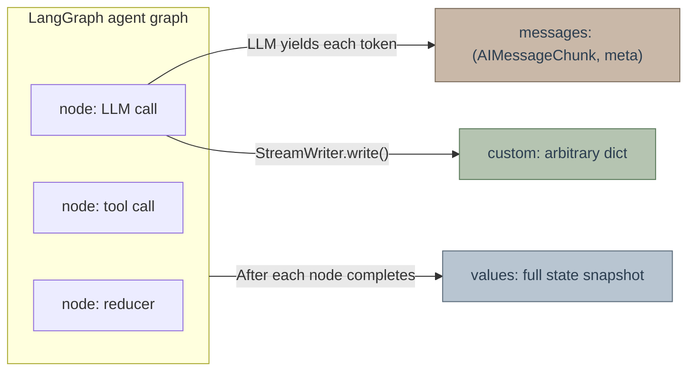
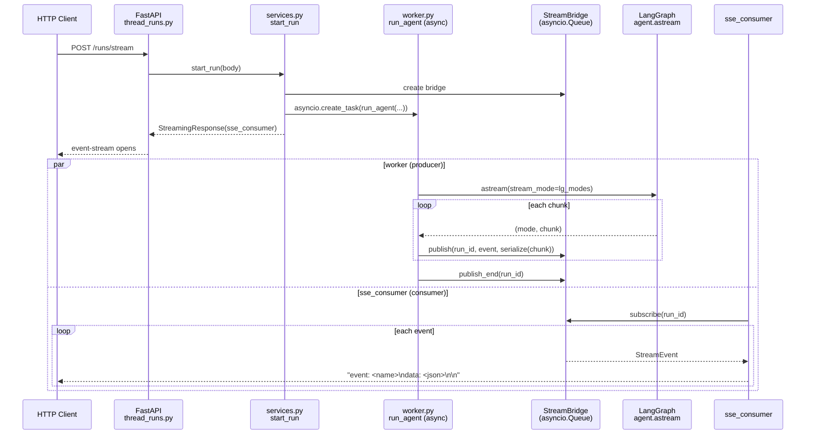
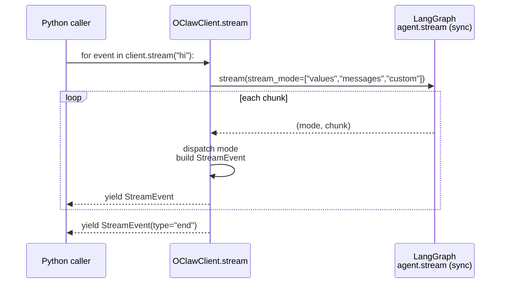
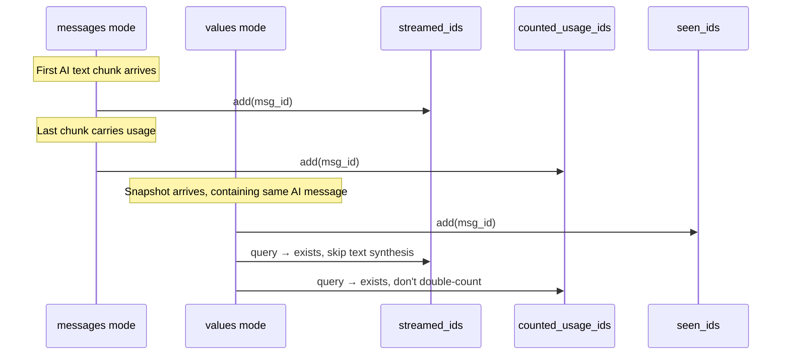
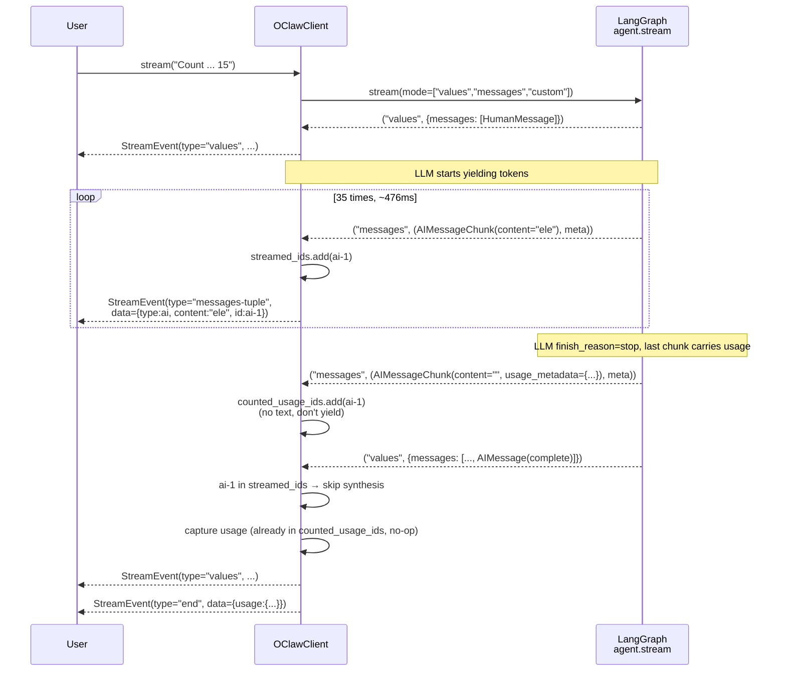

# OClaw Streaming Output Design

This document explains how OClaw delivers the LangGraph agent event stream end-to-end to two types of consumers (HTTP clients and embedded Python callers): why the two paths **must** coexist, what their respective contracts are, and the non-obvious invariants in the design.

---

## TL;DR

- OClaw has **two parallel** streaming paths: the **Gateway path** (async / HTTP SSE / JSON serialized) serving browsers and IM channels; and the **OClawClient path** (sync / in-process / native LangChain objects) serving Jupyter, scripts, and tests. They **cannot be merged** — the consumer models are different.
- Both paths start from the `create_agent()` factory, with the core being subscription to LangGraph's `stream_mode=["values", "messages", "custom"]`. `values` is node-level state snapshots, `messages` is LLM token-level deltas, and `custom` is explicit `StreamWriter` events. **These three modes are not granularity gradients but three independent event sources** — you must explicitly subscribe to `messages` for token streaming.
- The embedded client maintains three `set[str]` per `stream()` call: `seen_ids` / `streamed_ids` / `counted_usage_ids`. They look similar but manage **three independent invariants** and cannot be merged.

---

## Why Two Streaming Paths Exist

The two paths serve fundamentally different consumer models:

| Dimension | Gateway Path | OClawClient Path |
|---|---|---|
| Entry | FastAPI `/runs/stream` endpoint | `OClawClient.stream(message)` |
| Trigger layer | `runtime/runs/worker.py::run_agent` | `packages/harness/kkoclaw/client.py::OClawClient.stream` |
| Execution model | `async def` + `agent.astream()` | sync generator + `agent.stream()` |
| Event transport | `StreamBridge` (asyncio Queue) + `sse_consumer` | Direct `yield` |
| Serialization | `serialize(chunk)` → plain JSON dict, matching LangGraph Platform wire format | `StreamEvent.data`, carrying native LangChain objects |
| Consumers | Frontend `useStream` React hook, Feishu/Slack/Telegram channels, LangGraph SDK clients | Jupyter notebooks, integration tests, internal Python scripts |
| Lifecycle management | `RunManager`: run_id tracking, disconnect semantics, multitask strategy, heartbeat | None; function return ends it |
| Disconnect recovery | `Last-Event-ID` SSE reconnection | Not needed |

**The existence of two paths is a deliberate compromise over DRY**: The Gateway's entire infrastructure (async + Queue + JSON + RunManager) exists **entirely to deliver events across network boundaries to HTTP consumers**. When the producer (agent) and consumer (Python call stack) are in the same process, this entire apparatus is pure overhead.

### Why OClawClient Can't Reuse Gateway

Three reuse approaches were considered and rejected:

1. **Make `client.stream()` become `async def client.astream()`**  
   Breaking change. `async for` / `asyncio.run()` that users don't need would be forced into Jupyter notebooks and synchronous scripts. OClawClient's key selling point ("calling agent like a normal function") disappears.

2. **Spin up a separate event loop thread inside `client.stream()` and use `StreamBridge` to bridge sync/async**  
   Introduces thread pools, queues, semaphores. In order to "eliminate duplication," **complexity** is introduced instead of code lines. A classic "wrong abstraction" — overhead exceeds reuse benefit.

3. **Make `run_agent` itself compatible with sync mode**  
   Adds a dead branch to the Gateway that is never used, polluting worker.py's focus.

Therefore, the two paths' event handling logic will be **similar but not shared**. This is intentional design, not oversight.

---

## LangGraph `stream_mode` Three-Layer Semantics

LangGraph's `agent.stream(stream_mode=[...])` is a **multiplexing** interface: subscribe to multiple modes at once, each mode being an independent event source. Three core modes:



| Mode | Emit timing | Payload | Granularity |
|---|---|---|---|
| `values` | After each graph node completes | Full state dict (title, messages, artifacts) | Node-level |
| `messages` | LLM each yield of a chunk; tool node completion | `(AIMessageChunk \| ToolMessage, metadata_dict)` | Token-level |
| `custom` | User code explicitly calls `StreamWriter.write()` | Arbitrary dict | Application-defined |

### The Origin of Two Naming Conventions

The same thing has three names across **three protocol layers**:

```
Application                    HTTP / SSE                    LangGraph Graph
┌──────────────┐               ┌──────────────┐              ┌──────────────┐
│ frontend     │               │ LangGraph    │              │ agent.astream│
│ useStream    │──"messages-   │ Platform SDK │──"messages"──│ graph.astream│
│ Feishu IM    │   tuple"──────│ HTTP wire    │              │              │
└──────────────┘               └──────────────┘              └──────────────┘
```

- **Graph layer** (`agent.stream` / `agent.astream`): LangGraph Python direct API, mode is called **`"messages"`**.
- **Platform SDK layer** (`langgraph-sdk` HTTP client): Cross-process HTTP contract, mode is called **`"messages-tuple"`**.
- **Gateway worker** explicitly translates: `if m == "messages-tuple": lg_modes.append("messages")` (`runtime/runs/worker.py:117-121`).

**Consequence**: `OClawClient.stream()` directly calls `agent.stream()` (Graph layer), so it must pass `"messages"`. `app/channels/manager.py` goes through `langgraph-sdk` via HTTP SDK, so it passes `"messages-tuple"`. **These two strings cannot substitute for each other**, nor can they be extracted into "one shared constant" — they are type aliases of different protocol layers; sharing would only make one layer speak a language that isn't its native tongue.

---

## Gateway Path: async + HTTP SSE



Key components:

- `runtime/runs/worker.py::run_agent` — runs `agent.astream()` inside an `asyncio.Task`, converts each chunk to JSON via `serialize(chunk, mode=mode)`, then `bridge.publish()`.
- `runtime/stream_bridge` — abstract Queue. `publish/subscribe` decouples producer and consumer, supports `Last-Event-ID` reconnection, heartbeat, multi-subscriber fan-out.
- `app/gateway/services.py::sse_consumer` — subscribes from bridge, formats into SSE wire frames.
- `runtime/serialization.py::serialize` — mode-aware serialization; under `messages` mode, `serialize_messages_tuple` converts `(chunk, metadata)` to `[chunk.model_dump(), metadata]`.

**The value of `StreamBridge`'s existence**: When the producer (`run_agent` task) and consumer (HTTP connection) run in different asyncio tasks, an intermediary capable of passing events across tasks is needed. The Queue also serves as a buffer for disconnect reconnection and fan-out for multiple subscribers.

---

## OClawClient Path: sync + in-process



In contrast, the sync path has significantly fewer moving parts at every link:

- No `RunManager` — one `stream()` call corresponds to one lifecycle, no run_id needed.
- No `StreamBridge` — direct `yield`, production and consumption on the same Python call stack, no cross-task intermediary needed.
- No JSON serialization — `StreamEvent.data` directly holds native LangChain objects (`AIMessage.content`, `usage_metadata` as `UsageMetadata` TypedDict). Jupyter users get real types, not anonymous dicts.
- No asyncio — callers can directly `for event in ...`, no need to write `async for`.

---

## Consumption Semantics: delta vs cumulative

LangGraph `messages` mode gives **delta**: each `AIMessageChunk.content` contains only the newly yielded token this time, **not** cumulative text from the beginning.

This semantic matches LangChain's `fs2 Stream` style: **upstream sends increments, downstream is responsible for accumulation**. In the Gateway path, the frontend `useStream` React hook maintains its own accumulator; in the OClawClient path, the `chat()` method accumulates on behalf of the caller.

### `OClawClient.chat()`'s O(n) Accumulator

```python
chunks: dict[str, list[str]] = {}
last_id: str = ""
for event in self.stream(message, thread_id=thread_id, **kwargs):
    if event.type == "messages-tuple" and event.data.get("type") == "ai":
        msg_id = event.data.get("id") or ""
        delta = event.data.get("content", "")
        if delta:
            chunks.setdefault(msg_id, []).append(delta)
            last_id = msg_id
return "".join(chunks.get(last_id, ()))
```

**Why not `buffers[id] = buffers.get(id,"") + delta`**: CPython's string in-place concat optimization only takes effect when refcount=1 and LHS is a local name; here strings live in a dict and get reassigned, optimization invalidated, each time is O(n) copy → overall O(n²). Measured 50 KB / 5000 chunk replies take 100-300ms pure copy overhead. Using `list` + `"".join()` is O(n).

---

## Why Three Id Sets Cannot Be Merged

`OClawClient.stream()` maintains three `set[str]` within a single call lifecycle:

```python
seen_ids: set[str] = set()           # values path internal dedup
streamed_ids: set[str] = set()       # messages → values cross-mode dedup
counted_usage_ids: set[str] = set()  # usage_metadata idempotent counting
```

At first glance, they seem like "three nearly identical things," but each manages **different invariants**.

| Set | Invariant managed | Populated by | Queried by |
|---|---|---|---|
| `seen_ids` | For two consecutive `values` snapshots, the same message only generates one `messages-tuple` event | Added by values branch when processing each message | Checked by values branch before processing next message |
| `streamed_ids` | If a message has already been token-level streamed via `messages` mode, when the values snapshot arrives, do **not** synthesize another full `messages-tuple` | Added by messages branch each time an AI/tool event is emitted | Checked by values branch when seeing a message |
| `counted_usage_ids` | The same `usage_metadata` appears in both the messages tail chunk and the values snapshot's final AIMessage — **count the total only once** | Added by `_account_usage()` each time usage is accepted | Checked by `_account_usage()` on each call |

### Why One Set Isn't Enough

Key observation: **the same message id enters these three sets at different times**.



- `seen_ids` is **always added when the values snapshot arrives**, so it marks "values processed." A message that only appears in the messages stream (rare but possible) will never be in `seen_ids`.
- `streamed_ids` is **added at the first valid event from the messages stream**. A non-AI message that only arrives via values snapshot (HumanMessage, truncated tool message) will never be in `streamed_ids`.
- `counted_usage_ids` is **only added when non-empty `usage_metadata` is seen**. A message with no usage at all (tool message, error message) will never enter it.

**Set inclusion relationship**: `counted_usage_ids ⊆ (streamed_ids ∪ seen_ids)` roughly holds, but is **not a strict subset**, because a message can finish streaming text in messages mode but be overtaken by the values snapshot **before that final usage-carrying chunk** — at that point it's already in `streamed_ids` but not yet in `counted_usage_ids`. Merging them into one dict-of-flags would make this subtle timing dependency **disappear from the type system**, becoming just a sentence in a comment. Three independent sets make the invariants explicit: each set name corresponds to a question that can be answered verbally.

---

## End-to-End: Event Timeline for a Real Conversation

Assume calling `client.stream("Count from 1 to 15")`, LLM produces "one\ntwo\n...\nfifteen" (88 characters), tokenizer breaks it into ~35 BPE chunks. Below is a simplified version of the event arrival sequence:



Key observations:

1. The user sees **35 messages-tuple events**, spanning about 476ms, each carrying one token delta and the same `id=ai-1`.
2. The final `values` snapshot's `AIMessage` does **not** trigger another full `messages-tuple` event — because `ai-1 in streamed_ids` skipped synthesis.
3. The `usage` in the `end` event exactly equals that single cumulative usage, **not double** — `counted_usage_ids` already absorbed it at the messages tail chunk; the values branch's duplicate access is a no-op.
4. Consumers receive `content` as **deltas**: "ele" contains only 3 characters, not "one\ntwo\n...ele". To get full text, accumulate by `id`; `chat()` already does this for you.

---

## Why This Design Is Bug-Prone, and Testing Strategy

The direct motivation for this document is `kkoclaw#1969`: `OClawClient.stream()` originally only subscribed to `["values", "custom"]`, **missing `"messages"`**. As a result, `client.stream("hello")` was equivalent to a single batch return, visually indistinguishable from `chat()`.

This type of bug has three structural causes:

1. **Multi-protocol-layer naming**: `messages` / `messages-tuple` / HTTP SSE `messages` are three names for the same concept. Getting it wrong at one layer won't error at the other two.
2. **Multi-consumer model**: Gateway and OClawClient are two independent implementations with **no single source of truth for "which modes to subscribe to"**. The former subscribing correctly doesn't mean the latter also did.
3. **Mock tests bypass the real path**: Old tests used `agent.stream.return_value = iter([dict_chunk, ...])` feeding values-shaped dicts to simulate state snapshots. Input constructed this way **never enters the `messages` mode branch**, so even if `stream_mode` is missing an element, CI is still all green.

### Defense Measures

The real defense is **explicit assertions that "messages" mode is subscribed + mocking with real chunk shapes**:

```python
# tests/test_client.py::test_messages_mode_emits_token_deltas
agent.stream.return_value = iter([
    ("messages", (AIMessageChunk(content="Hel", id="ai-1"), {})),
    ("messages", (AIMessageChunk(content="lo ", id="ai-1"), {})),
    ("messages", (AIMessageChunk(content="world!", id="ai-1"), {})),
    ("values", {"messages": [HumanMessage(...), AIMessage(content="Hello world!", id="ai-1")]}),
])
# ...
assert [e.data["content"] for e in ai_text_events] == ["Hel", "lo ", "world!"]
assert len(ai_text_events) == 3  # values snapshot must NOT re-synthesize
assert "messages" in agent.stream.call_args.kwargs["stream_mode"]
```

**Why this is more effective than "extracting one shared constant"**: A shared constant can only guarantee that "people using it write the string correctly," but a newly added consumer might not even know where the constant is. Behavioral assertions force any change to go through the **actual execution path**; changing back to `["values", "custom"]` would immediately fail `assert "messages" in ...`.

### Liveness Signal: BPE Subword Boundaries

The ultimate regression verification is to have a real LLM count 1-15 and check whether the tokenizer's subword segmentation can be observed in the output:

```
[5.460s] 'ele' / 'ven'      eleven broken into two tokens
[5.508s] 'tw'  / 'elve'     twelve broken into two
[5.568s] 'th'  / 'irteen'   thirteen broken into two
[5.623s] 'four'/ 'teen'     fourteen broken into two
[5.677s] 'f'   / 'if' / 'teen'  fifteen broken into three
```

Subword segmentation is an external fact of the tokenizer that **cannot be faked**. Seeing it proves that the data stream **chunk by chunk** traversed the entire pipeline without being buffered into full paragraphs by any intermediate layer. This "liveness signal" is higher-confidence evidence in streaming systems than unit tests.

---

## Related Source Locations

| What you care about | Look here |
|---|---|
| OClawClient embedded streaming | `packages/harness/kkoclaw/client.py::OClawClient.stream` |
| `chat()`'s delta accumulator | `packages/harness/kkoclaw/client.py::OClawClient.chat` |
| Gateway async streaming | `packages/harness/kkoclaw/runtime/runs/worker.py::run_agent` |
| HTTP SSE frame output | `app/gateway/services.py::sse_consumer` / `format_sse` |
| Serialization to wire format | `packages/harness/kkoclaw/runtime/serialization.py` |
| LangGraph mode name translation | `packages/harness/kkoclaw/runtime/runs/worker.py:117-121` |
| Feishu channel incremental card updates | `app/channels/manager.py::_handle_streaming_chat` |
| Channels' built-in delta/cumulative defensive accumulation | `app/channels/manager.py::_merge_stream_text` |
| Frontend useStream supported mode set | `frontend/src/core/api/stream-mode.ts` |
| Core regression test | `backend/tests/test_client.py::TestStream::test_messages_mode_emits_token_deltas` |
