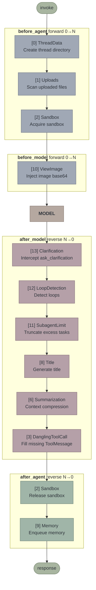
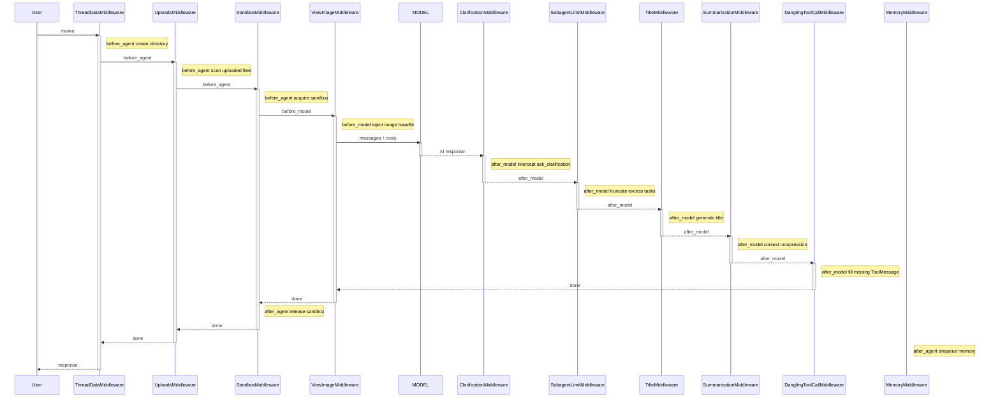
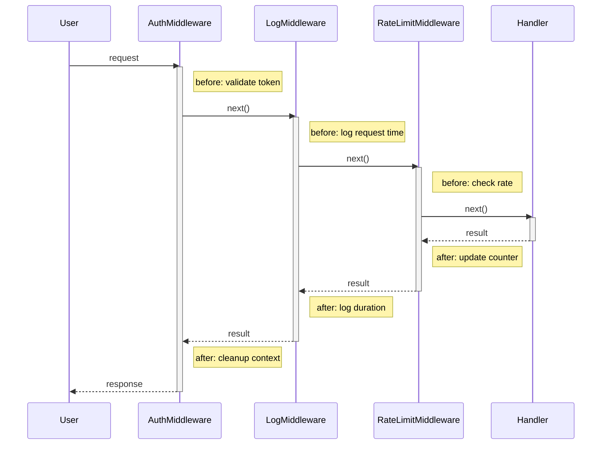
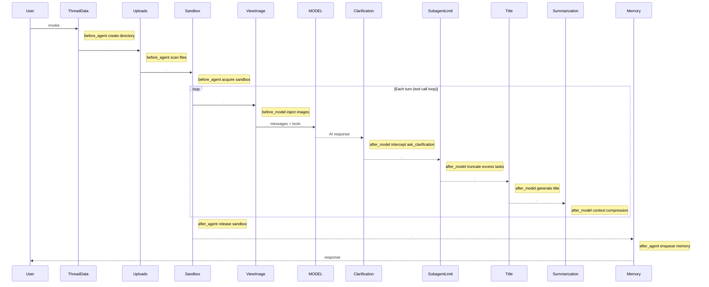

# Middleware Execution Flow

## Middleware List

The full middleware chain assembled by `create_kkoclaw_agent` via `RuntimeFeatures` (with all features enabled by default):

| # | Middleware | `before_agent` | `before_model` | `after_model` | `after_agent` | `wrap_tool_call` | Lead Agent | Subagent | Source |
|---|-----------|:-:|:-:|:-:|:-:|:-:|:-:|:-:|------|
| 0 | ThreadDataMiddleware | ✓ | | | | | ✓ | ✓ | `sandbox` |
| 1 | UploadsMiddleware | ✓ | | | | | ✓ | ✗ | `sandbox` |
| 2 | SandboxMiddleware | ✓ | | | ✓ | | ✓ | ✓ | `sandbox` |
| 3 | DanglingToolCallMiddleware | | | ✓ | | | ✓ | ✗ | Always on |
| 4 | GuardrailMiddleware | | | | | ✓ | ✓ | ✓ | *Phase 2 included* |
| 5 | ToolErrorHandlingMiddleware | | | | | ✓ | ✓ | ✓ | Always on |
| 6 | SummarizationMiddleware | | | ✓ | | | ✓ | ✗ | `summarization` |
| 7 | TodoMiddleware | | | ✓ | | | ✓ | ✗ | `plan_mode` param |
| 8 | TitleMiddleware | | | ✓ | | | ✓ | ✗ | `auto_title` |
| 9 | MemoryMiddleware | | | | ✓ | | ✓ | ✗ | `memory` |
| 10 | ViewImageMiddleware | | ✓ | | | | ✓ | ✗ | `vision` |
| 11 | SubagentLimitMiddleware | | | ✓ | | | ✓ | ✗ | `subagent` |
| 12 | LoopDetectionMiddleware | | | ✓ | | | ✓ | ✗ | Always on |
| 13 | ClarificationMiddleware | | | ✓ | | | ✓ | ✗ | Always last |

Lead agent has **14** middleware layers (`make_lead_agent`), subagent has **4** (ThreadData, Sandbox, Guardrail, ToolErrorHandling). `create_kkoclaw_agent` Phase 1 implements **13** (Guardrail only supports custom instances, no built-in default).

## Execution Flow

LangChain `create_agent` rules:
- **`before_*` executes in forward order** (list position 0 → N)
- **`after_*` executes in reverse order** (list position N → 0)



## Sequence Diagram



## Onion Model

List position determines the layer in the onion — position 0 is the outermost layer, position N is the innermost:

```
Enter before_*:   [0] → [1] → [2] → ... → [10] → MODEL
Exit after_*:     MODEL → [13] → [11] → ... → [6] → [3] → [2] → [0]
                          ↑ Innermost executes first
```

> [!important] Core Rule
> The middleware at the end of the list has its `after_model` execute **first**.
> ClarificationMiddleware is at the end of the list, so it intercepts model output first.

## Comparison: True Onion vs OClaw's Reality

### True Onion (e.g., Koa/Express)

Each middleware handles both before and after, forming symmetric nesting:



> [!tip] Onion Characteristics
> Each middleware has symmetric before/after operations, `activate` spans the entire inner execution, forming perfect nesting.

### OClaw's Reality

It's not an onion, it's a pipeline. Most middleware only uses one hook, there is no symmetric nesting. In multi-turn conversations, before_model / after_model execute in a loop:



> [!warning] Not an Onion
> Out of 14 middleware, only SandboxMiddleware has before/after symmetry (acquire/release). The rest are unidirectional: they either only do things in `before_*` or only in `after_*`. `before_agent` / `after_agent` run only once, `before_model` / `after_model` run on every loop iteration.

There are only 2 hard dependencies:

1. **ThreadData before Sandbox** — sandbox needs the thread directory
2. **Clarification at the end of the list** — `after_model` executes first in reverse order, first to intercept `ask_clarification`

### Conclusion

| | True Onion | OClaw Actual |
|---|---|---|
| Each middleware | before + after symmetric | Mostly uses only one hook |
| Activation bars | Nested (outer long, inner short) | Not nested (serial) |
| Meaning of reverse order | Cleanup paired with initialization | Only affects after_model execution priority |
| Typical example | Auth: validate token / cleanup context | ThreadData: only create directory, no cleanup |

## Key Design Points

### Why is ClarificationMiddleware at the End of the List?

Last position = `after_model` executes first. It needs to be the **first** to see model output and check for `ask_clarification` tool calls. If found, it immediately interrupts (`Command(goto=END)`), and subsequent middleware `after_model` calls are not executed.

### SandboxMiddleware's Symmetry

`before_agent` (3rd in forward order) acquires the sandbox, `after_agent` (1st in reverse order) releases the sandbox. Outer entry → outer exit, natural onion symmetry.

### Most Middleware Uses Only One Hook

Out of 14 middleware, only SandboxMiddleware uses both `before_agent` + `after_agent` (acquire/release). All others execute in only one phase. The onion model's reverse order characteristic mainly affects the execution order of the `after_model` phase.
