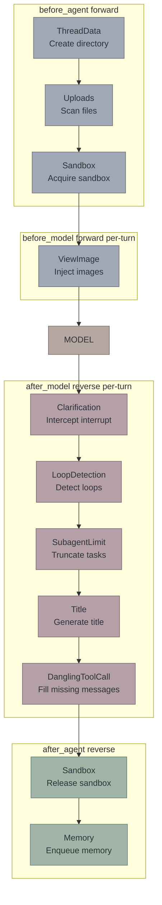

# RFC: `create_kkoclaw_agent` — Pure-Parameter SDK Factory API

## 1. Problem

The current harness's only public entry point is `make_lead_agent(config: RunnableConfig)`. Internally it does:

```
make_lead_agent
  ├─ get_app_config()          ← reads config.yaml
  ├─ _resolve_model_name()     ← reads config.yaml
  ├─ load_agent_config()       ← reads agents/{name}/config.yaml
  ├─ create_chat_model(name)   ← reads config.yaml (reflective model class loading)
  ├─ get_available_tools()     ← reads config.yaml + extensions_config.json
  ├─ apply_prompt_template()   ← reads skills directory + memory.json
  └─ _build_middlewares()      ← reads config.yaml (summarization, model vision)
```

**6 implicit I/O points** — all dependent on the filesystem. If you want to embed `kkoclaw-harness` as a Python library in your own application, you must prepare `config.yaml` + `extensions_config.json` + skills directory. This is unacceptable for SDK users.

### Comparison

| | `langchain.create_agent` | `make_lead_agent` | `OClawClient` (enhanced) |
|---|---|---|---|
| Positioning | Low-level primitive | Internal factory | **Only public API** |
| Config source | Pure parameters | YAML files | **Parameters first, config fallback** |
| Built-in capabilities | None | Sandbox/Memory/Skills/Subagent/... | **On-demand composition + management API** |
| User interface | `graph.invoke(state)` | Internal use | **`client.chat("hello")`** |
| For whom | LangChain authors | Internal use | **All OClaw users** |

## 2. Design Principles

### DI Best Practices in Python

1. **Function parameters are injection** — don't read global state, pass all dependencies via parameters
2. **Protocol defines contracts** — don't depend on concrete classes, depend on behavioral interfaces
3. **Sensible defaults** — `sandbox=True` equals `sandbox=LocalSandboxProvider()`
4. **Layered API** — simple usage is one line, complex usage has escape hatches

### Layered Architecture

```
    ┌──────────────────────┐
    │   OClawClient     │  ← Only public API (chat/stream + management)
    └──────────┬───────────┘
    ┌──────────▼───────────┐
    │   make_lead_agent    │  ← Internal: config-driven factory
    └──────────┬───────────┘
    ┌──────────▼───────────┐
    │  create_kkoclaw_agent   │  ← Internal: pure-parameter factory
    └──────────┬───────────┘
    ┌──────────▼───────────┐
    │ langchain.create_agent│  ← Low-level primitive
    └──────────────────────┘
```

`OClawClient` is the only public API. `create_kkoclaw_agent` and `make_lead_agent` are both internal implementations.

Users control behavior via three `OClawClient` parameters:

| Parameter | Type | Responsibility |
|------|------|------|
| `config` | `dict` | Override any config.yaml settings |
| `features` | `RuntimeFeatures` | Replace built-in middleware implementations |
| `extra_middleware` | `list[AgentMiddleware]` | Add new user middleware |

No parameters → reads config.yaml (existing behavior, fully compatible).

### Core Constraints

- **Config override** — `config` dict > config.yaml > defaults
- **Three non-overlapping layers** — config passes parameters, features passes instances, extra_middleware passes additions
- **Forward compatibility** — existing `OClawClient()` no-arg construction behavior unchanged
- **Harness boundary compliance** — does not import `app.*` (enforced by `test_harness_boundary.py`)

## 3. API Design

### 3.1 `OClawClient` — Only Public API

Three optional parameters added to the existing constructor:

```python
from kkoclaw.client import OClawClient
from kkoclaw.agents.features import RuntimeFeatures

client = OClawClient(
    # 1. config — override any key in config.yaml (structure matches yaml)
    config={
        "models": [{"name": "gpt-4o", "use": "langchain_openai:ChatOpenAI", "model": "gpt-4o", "api_key": "sk-..."}],
        "memory": {"max_facts": 50, "enabled": True},
        "title": {"enabled": False},
        "summarization": {"enabled": True, "trigger": [{"type": "tokens", "value": 10000}]},
        "sandbox": {"use": "kkoclaw.sandbox.local:LocalSandboxProvider"},
    },

    # 2. features — replace built-in middleware implementations
    features=RuntimeFeatures(
        memory=MyMemoryMiddleware(),
        auto_title=MyTitleMiddleware(),
    ),

    # 3. extra_middleware — add new user middleware
    extra_middleware=[
        MyAuditMiddleware(),       # @Next(SandboxMiddleware)
        MyFilterMiddleware(),      # @Prev(ClarificationMiddleware)
    ],
)
```

Three typical usage patterns:

```python
# Usage 1: Full config.yaml read (existing behavior, unchanged)
client = OClawClient()

# Usage 2: Change parameters only, don't swap implementations
client = OClawClient(config={"memory": {"max_facts": 50}})

# Usage 3: Replace middleware implementations
client = OClawClient(features=RuntimeFeatures(auto_title=MyTitleMiddleware()))

# Usage 4: Add custom middleware
client = OClawClient(extra_middleware=[MyAuditMiddleware()])

# Usage 5: Pure SDK (no config.yaml)
client = OClawClient(config={
    "models": [{"name": "gpt-4o", "use": "langchain_openai:ChatOpenAI", ...}],
    "tools": [{"name": "bash", "use": "kkoclaw.sandbox.tools:bash_tool", "group": "bash"}],
    "memory": {"enabled": True},
})
```

Internal: `final_config = deep_merge(file_config, code_config)`

### 3.2 `create_kkoclaw_agent` — Internal Factory (Not Public)

```python
def create_kkoclaw_agent(
    model: BaseChatModel,
    tools: list[BaseTool] | None = None,
    *,
    system_prompt: str | None = None,
    middleware: list[AgentMiddleware] | None = None,
    features: RuntimeFeatures | None = None,
    state_schema: type | None = None,
    checkpointer: BaseCheckpointSaver | None = None,
    name: str = "default",
) -> CompiledStateGraph:
    ...
```

Called internally by `OClawClient`.

### 3.3 `RuntimeFeatures` — Built-in Middleware Replacement

Does one thing: replaces built-in middleware with custom instances. Does not manage parameters (parameters go through `config` dict).

```python
@dataclass
class RuntimeFeatures:
    sandbox: bool | AgentMiddleware = True
    memory: bool | AgentMiddleware = False
    summarization: bool | AgentMiddleware = False
    subagent: bool | AgentMiddleware = False
    vision: bool | AgentMiddleware = False
    auto_title: bool | AgentMiddleware = False
```

| Value | Meaning |
|---|---|
| `True` | Use default middleware (parameters read from config) |
| `False` | Disable the feature |
| `AgentMiddleware` instance | Replace the entire implementation |

No more `MemoryOptions`, `TitleOptions`, etc. Parameter adjustments go through `config` dict:

```python
# Change memory params → config
client = OClawClient(config={"memory": {"max_facts": 50}})

# Swap memory impl → features
client = OClawClient(features=RuntimeFeatures(memory=MyMemoryMiddleware()))

# Combine — config params for default middleware, but title swaps impl
client = OClawClient(
    config={"memory": {"max_facts": 50}},
    features=RuntimeFeatures(auto_title=MyTitleMiddleware()),
)
```

### 3.4 Middleware Chain Assembly

No priority numbers for ordering. Build the list in fixed append order:

```python
def _resolve(spec, default_cls):
    """bool → default impl / AgentMiddleware → replacement"""
    if isinstance(spec, AgentMiddleware):
        return spec
    return default_cls()

def _assemble_from_features(feat: RuntimeFeatures, config: AppConfig) -> tuple[list, list]:
    chain = []
    extra_tools = []

    if feat.sandbox:
        chain.append(_resolve(feat.sandbox, ThreadDataMiddleware))
        chain.append(UploadsMiddleware())
        chain.append(_resolve(feat.sandbox, SandboxMiddleware))

    chain.append(DanglingToolCallMiddleware())
    chain.append(ToolErrorHandlingMiddleware())

    if feat.summarization:
        chain.append(_resolve(feat.summarization, SummarizationMiddleware))
    if config.title.enabled and feat.auto_title is not False:
        chain.append(_resolve(feat.auto_title, TitleMiddleware))
    if feat.memory:
        chain.append(_resolve(feat.memory, MemoryMiddleware))
    if feat.vision:
        chain.append(ViewImageMiddleware())
        extra_tools.append(view_image_tool)
    if feat.subagent:
        chain.append(_resolve(feat.subagent, SubagentLimitMiddleware))
        extra_tools.append(task_tool)
    if feat.loop_detection:
        chain.append(_resolve(feat.loop_detection, LoopDetectionMiddleware))

    # Insert extra_middleware (positioned via @Next/@Prev declarations)
    _insert_extra(chain, extra_middleware)

    # Clarification always last
    chain.append(ClarificationMiddleware())
    extra_tools.append(ask_clarification_tool)

    return chain, extra_tools
```

### 3.6 Middleware Ordering Strategy

**Two-phase ordering: built-in fixed + external insertion**

1. **Built-in chain fixed order** — determined by code append order, does not participate in @Next/@Prev
2. **External middleware insertion** — middleware in `extra_middleware` declares anchors via @Next/@Prev, freely anchoring to any middleware (built-in or other external)
3. **Conflict detection** — if two external middleware @Next or @Prev the same target → `ValueError`

**This is not a total ordering.** The built-in chain order is determined in code; external middleware only does insertion. This avoids built-in and external competing for the same position.

### 3.7 `@Next` / `@Prev` Decorators

User-defined middleware declares its position in the chain via decorators, type-safe:

```python
from kkoclaw.agents import Next, Prev

@Next(SandboxMiddleware)
class MyAuditMiddleware(AgentMiddleware):
    """Placed after SandboxMiddleware"""
    def before_agent(self, state, runtime):
        ...

@Prev(ClarificationMiddleware)
class MyFilterMiddleware(AgentMiddleware):
    """Placed before ClarificationMiddleware"""
    def after_model(self, state, runtime):
        ...
```

Implementation:

```python
def Next(anchor: type[AgentMiddleware]):
    """Decorator: declare this middleware's position is right after anchor."""
    def decorator(cls: type[AgentMiddleware]) -> type[AgentMiddleware]:
        cls._next_anchor = anchor
        return cls
    return decorator

def Prev(anchor: type[AgentMiddleware]):
    """Decorator: declare this middleware's position is right before anchor."""
    def decorator(cls: type[AgentMiddleware]) -> type[AgentMiddleware]:
        cls._prev_anchor = anchor
        return cls
    return decorator
```

`_insert_extra` algorithm:

1. Iterate `extra_middleware`, read each middleware's `_next_anchor` / `_prev_anchor`
2. **Conflict detection**: if two external middleware anchor to the same target (same direction), throw `ValueError`
3. Middleware with anchors inserted at target position (@Next → after target, @Prev → before target)
4. Middleware without declarations appended before Clarification

## 4. Middleware Execution Model

### LangChain Execution Rules

```
before_agent forward →  [0] → [1] → ... → [N]
before_model forward →  [0] → [1] → ... → [N]  ← per-loop
         MODEL
after_model reverse ←   [N] → [N-1] → ... → [0]  ← per-loop
after_agent reverse ←   [N] → [N-1] → ... → [0]
```

`before_agent` / `after_agent` run only once. `before_model` / `after_model` run every tool call loop iteration.

### OClaw's Reality

**Not an onion, a pipeline.** Among 11 middleware, only SandboxMiddleware has before/after symmetry (acquire/release); the rest use only one hook.

Only 2 hard dependencies:
1. **ThreadData before Sandbox** — sandbox needs the thread directory
2. **Clarification at the end of the list** — after_model executes first in reverse order, first to intercept `ask_clarification`

See [middleware-execution-flow.md](middleware-execution-flow.md) for details.

## 5. Usage Examples

### 5.1 Full config.yaml Read (Existing Behavior Unchanged)

```python
from kkoclaw.client import OClawClient

client = OClawClient()
response = client.chat("Hello")
```

### 5.2 Override Config Parameters

```python
client = OClawClient(config={
    "memory": {"max_facts": 50},
    "title": {"enabled": False},
    "summarization": {"trigger": [{"type": "tokens", "value": 10000}]},
})
```

### 5.3 Pure SDK (No config.yaml)

```python
client = OClawClient(config={
    "models": [{"name": "gpt-4o", "use": "langchain_openai:ChatOpenAI", "model": "gpt-4o", "api_key": "sk-..."}],
    "tools": [
        {"name": "bash", "group": "bash", "use": "kkoclaw.sandbox.tools:bash_tool"},
        {"name": "web_search", "group": "web", "use": "kkoclaw.community.tavily.tools:web_search_tool"},
    ],
    "memory": {"enabled": True, "max_facts": 50},
    "sandbox": {"use": "kkoclaw.sandbox.local:LocalSandboxProvider"},
})
```

### 5.4 Replace Built-in Middleware

```python
from kkoclaw.agents.features import RuntimeFeatures

client = OClawClient(
    features=RuntimeFeatures(
        memory=MyMemoryMiddleware(),       # Replace
        auto_title=MyTitleMiddleware(),    # Replace
        vision=False,                      # Disable
    ),
)
```

### 5.5 Insert Custom Middleware

```python
from kkoclaw.agents import Next, Prev
from kkoclaw.sandbox.middleware import SandboxMiddleware
from kkoclaw.agents.middlewares.clarification_middleware import ClarificationMiddleware

@Next(SandboxMiddleware)
class MyAuditMiddleware(AgentMiddleware):
    def before_agent(self, state, runtime):
        log_sandbox_acquired(state)

@Prev(ClarificationMiddleware)
class MyFilterMiddleware(AgentMiddleware):
    def after_model(self, state, runtime):
        filter_sensitive_output(state)

client = OClawClient(
    extra_middleware=[MyAuditMiddleware(), MyFilterMiddleware()],
)
```

## 6. Phase 1 Limitations

The following middleware still internally read `config.yaml`; SDK users should be aware:

| Middleware | Reads | Phase 2 Solution |
|------------|---------|-----------------|
| TitleMiddleware | `get_title_config()` + `create_chat_model()` | `TitleOptions(model=...)` param override |
| MemoryMiddleware | `get_memory_config()` | `MemoryOptions(...)` param override |
| SandboxMiddleware | `get_sandbox_provider()` | `SandboxProvider` instance direct pass |

In Phase 1, `auto_title` defaults to `False` to avoid crashing without config. Other features with config dependencies also default to `False`.

## 7. Migration Path

```
Phase 1 (current PR #1203):
  ✓ Add create_kkoclaw_agent + RuntimeFeatures (internal API)
  ✓ Don't change OClawClient and make_lead_agent
  ✗ middleware still internally reads config (known limitation)

Phase 2 (#1380):
  - OClawClient constructor adds optional params (model, tools, features, system_prompt)
  - Options params override config (MemoryOptions, TitleOptions, etc.)
  - @Next/@Prev decorators
  - Add missing middleware (Guardrail, TokenUsage, DeferredToolFilter)
  - make_lead_agent becomes thin shell calling create_kkoclaw_agent

Phase 3:
  - SDK documentation and examples
  - kkoclaw.client stable API
```

## 8. Design Decisions

| Question | Decision | Rationale |
|------|------|------|
| Public API | `OClawClient` single entry | Top-down, change existing API before extracting lower layers |
| create_kkoclaw_agent | Internal only, not public | Users don't need access to CompiledStateGraph |
| Config override | `config` dict, same structure as config.yaml | No new concept, deep merge override |
| Middleware replacement | `features=RuntimeFeatures(memory=MyMW())` | bool toggle + instance replacement |
| Middleware extension | `extra_middleware` independent param | Separate from built-in features |
| Middleware positioning | `@Next/@Prev` decorators | Type-safe, doesn't expose ordering details |
| Ordering mechanism | Sequential append + @Next/@Prev | Priority numbers have no functional meaning |
| Runtime toggles | Keep `RunnableConfig` | plan_mode, thread_id, etc. switch per request |

## 9. Appendix: Middleware Chain



Hard dependencies:
- ThreadData → Uploads → Sandbox (before_agent phase)
- Clarification must be at the end of the list (after_model executes first in reverse order)

## 10. Lead Agent vs Subagent Middleware Differences

The lead agent and subagent share the base middleware chain (`_build_runtime_middlewares`), with subagent simplifying on top of that:

| Middleware | Lead Agent | Subagent | Notes |
|------------|:-------:|:--------:|------|
| ThreadDataMiddleware | ✓ | ✓ | Shared: create thread directory |
| UploadsMiddleware | ✓ | ✗ | Lead-only: scan uploaded files |
| SandboxMiddleware | ✓ | ✓ | Shared: acquire/release sandbox |
| DanglingToolCallMiddleware | ✓ | ✗ | Lead-only: fill missing ToolMessage |
| GuardrailMiddleware | ✓ | ✓ | Shared: tool call authorization (optional) |
| ToolErrorHandlingMiddleware | ✓ | ✓ | Shared: tool exception handling |
| SummarizationMiddleware | ✓ | ✗ | |
| TodoMiddleware | ✓ | ✗ | |
| TitleMiddleware | ✓ | ✗ | |
| MemoryMiddleware | ✓ | ✗ | |
| ViewImageMiddleware | ✓ | ✗ | |
| SubagentLimitMiddleware | ✓ | ✗ | |
| LoopDetectionMiddleware | ✓ | ✗ | |
| ClarificationMiddleware | ✓ | ✗ | |

**Design principles**:
- `RuntimeFeatures`, `@Next/@Prev`, ordering mechanism only affect the **lead agent**
- Subagent chain is short and fixed (4), no dynamic assembly needed
- `extra_middleware` currently only affects the lead agent, not passed to subagents
